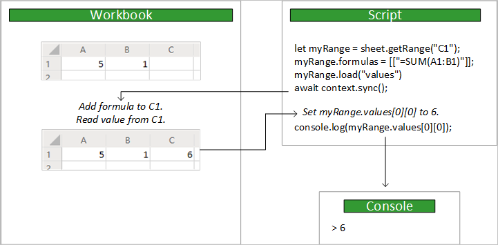

# <a name="using-the-office-scripts-async-apis-to-support-legacy-scripts"></a>Usando as APIs assíncronas de scripts do Office para suportar scripts herdados

Este artigo ensina como escrever scripts usando as APIs herdadas, assíncronas. Essas APIs têm a mesma funcionalidade principal que as APIs de scripts síncronas padrão, mas exigem que seu script controle a sincronização de dados entre o script e a pasta de trabalho.

> [!IMPORTANT]
> O modelo assíncrono só pode ser usado com scripts criados antes da implementação do modelo de [API](scripting-fundamentals.md?view=office-scripts)atual. Os scripts são bloqueados permanentemente para o modelo de API que têm na criação. Isso também significa que se você quiser converter um script herdado para o novo modelo, deverá usar um script de marca novo. Recomendamos que você atualize seus scripts antigos para o novo modelo ao fazer alterações, já que o modelo atual é mais fácil de usar. A [conversão de scripts assíncronos herdados para a seção modelo atual](#converting-legacy-async-scripts-to-the-current-model) tem conselhos sobre como fazer essa transição.

## <a name="main-function"></a>função `main`

Scripts que usam as APIs assíncronas têm uma `main` função diferente. É uma `async` função que tem um `Excel.RequestContext` como o primeiro parâmetro.

```TypeScript
async function main(context: Excel.RequestContext) {
    // Your async Office Script
}
```

## <a name="context"></a>Contexto

A função `main` aceita um parâmetro `Excel.RequestContext`, chamado `context`. Imagine `context` como a ponte entre o seu script e a pasta de trabalho. Seu script acessa a pasta de trabalho com o objeto `context` e usa esse `context` para troca de dados.

O objeto `context` é necessário porque o script e o Excel estão sendo executados em processos e locais diferentes. O script precisará fazer alterações ou consultar dados da pasta de trabalho na nuvem. O objeto `context` gerencia essas transações.

## <a name="sync-and-load"></a>Sincronizar e carregar

Como o seu script e a pasta de trabalho são executados em locais diferentes, qualquer transferência de dados entre os dois levará algum tempo. Na API Async, os comandos são enfileirados até que o script chame explicitamente a `sync` operação para sincronizar o script e a pasta de trabalho. Seu script pode trabalhar de forma independente até que precise executar uma das seguintes ações:

- Leia os dados da pasta de trabalho (seguindo uma `load` operação ou método que retorne um [ClientResult](/javascript/api/office-scripts/excel/excel.clientresult?view=office-scripts-async)).
- Gravar dados na pasta de trabalho (geralmente porque o script terminou).

A imagem a seguir mostra um exemplo de fluxo de controle entre o script e a pasta de trabalho:



### <a name="sync"></a>Sincronizar

Sempre que o script assíncrono precisa ler dados de ou gravar dados na pasta de trabalho, chame o `RequestContext.sync` método conforme mostrado aqui:

```TypeScript
await context.sync();
```

> [!NOTE]
> `context.sync()` é chamado implicitamente quando um script termina.

Após a conclusão da operação `sync`, a pasta de trabalho será atualizada para refletir as operações de gravação especificados por esse script. Uma operação de gravação está definindo uma propriedade em um objeto do Excel (por exemplo, `range.format.fill.color = "red"`) ou chamando um método que altera uma propriedade (por exemplo, `range.format.autoFitColumns()`). A `sync` operação também lê todos os valores da pasta de trabalho que o script solicitou usando uma `load` operação ou um método que retorna a `ClientResult` (conforme discutido nas próximas seções).

A sincronização do seu script com a pasta de trabalho pode demorar, dependendo da sua rede. Minimize o número de `sync` chamadas para ajudar seu script a ser executado rapidamente. Caso contrário, as APIs assíncronas não serão mais rápidas as APIs síncronas padrão.

### <a name="load"></a>Carregar

Um script assíncrono deve carregar dados da pasta de trabalho antes de lê-lo. No entanto, carregar dados de toda a pasta de trabalho reduziria imensamente a velocidade do script. O `load` método permite que o script declare especificamente quais dados devem ser recuperados da pasta de trabalho.

O método `load` está disponível em todos os objetos do Excel. Seu script deve carregar as propriedades de um objeto para poder lê-lo. Não fazer isso resulta em um erro.

Os exemplos a seguir usam um objeto `Range` para mostrar as três maneiras de usar o método `load` para carregar dados.

|Finalidade |Comando de exemplo | Efeito |
|:--|:--|:--|
|Carregar uma propriedade |`myRange.load("values");` | Carrega uma única propriedade, neste caso, a matriz bidimensional de valores nesse intervalo. |
|Carregar várias propriedades |`myRange.load("values, rowCount, columnCount");`| Carrega todas as propriedades de uma lista delimitada por vírgulas, neste exemplo, os valores, a contagem de linhas e de colunas. |
|Carregar tudo | `myRange.load();`|Carrega todas as propriedades no intervalo. Essa não é uma solução recomendada, já que ela tornará mais lento o script, obtendo dados desnecessários. Só use isso ao testar o script ou se você precisar de todas as propriedades do objeto. |

Seu script deve chamar `context.sync()` antes de ler os valores carregados.

```TypeScript
/**
 * This script uses the async API to get the row count for a range.
 * It shows how to load a property in the async model.
 */
async function main(context: Excel.RequestContext) {
    let selectedSheet = context.workbook.worksheets.getActiveWorksheet();
    let range = selectedSheet.getRange("A1:B3");

    // Load the property.
    range.load("rowCount");

    // Synchronize with the workbook to get the property.
    await context.sync();

    // Read and log the property value (3).
    console.log(range.rowCount);
}
```

Você também pode carregar as propriedades em uma coleção. Cada objeto de coleção na API Async tem uma `items` propriedade que é uma matriz que contém os objetos dessa coleção. Usar `items` como o início de uma chamada hierárquica (`items\myProperty`) para `load` carrega as propriedades especificadas em cada um desses itens. O exemplo a seguir carrega a propriedade `resolved` em cada objeto `Comment` no objeto `CommentCollection` de uma planilha.

```TypeScript
/**
 * This script uses the async API to get resolved property on every comment in the worksheet.
 * It shows how to load a property from every object in a collection.
 */
async function main(context: Excel.RequestContext){
    let selectedSheet = context.workbook.worksheets.getActiveWorksheet();
    let comments = selectedSheet.comments;

    // Load the `resolved` property from every comment in this collection.
    comments.load("items/resolved");

    // Synchronize with the workbook to get the properties.
    await context.sync();
}
```

### <a name="clientresult"></a>ClientResult

Os métodos na API Async que retornam informações da pasta de trabalho têm um padrão semelhante ao `load` / `sync` paradigma. Por exemplo, `TableCollection.getCount` obtém o número de tabelas da coleção. `getCount` retorna um `ClientResult<number>`, o que significa que a `value` propriedade no retorno `ClientResult` é um número. Seu script não pode acessar esse valor até que `context.sync()` seja chamado. Assim como carregar uma propriedade, o `value` é um valor local "vazio" até a `sync` chamada.

O script a seguir obtém o número total de tabelas na pasta de trabalho e registra esse número no console.

```TypeScript
/**
 * This script uses the async API to get the table count of the workbook.
 * It shows how ClientResult objects return workbook information.
 */
async function main(context: Excel.RequestContext) {
    let tableCount = context.workbook.tables.getCount();

    // This sync call implicitly loads tableCount.value.
    // Any other ClientResult values are loaded too.
    await context.sync();

    // Trying to log the value before calling sync would throw an error.
    console.log(tableCount.value);
}
```

## <a name="converting-legacy-async-scripts-to-the-current-model"></a>Convertendo scripts assíncronos herdados para o modelo atual

O modelo de API atual não `load` usa `sync` o, o ou um `RequestContext` . Isso torna os scripts muito mais fáceis de escrever e manter. O melhor recurso para conversão de scripts antigos é o [estouro de pilha](https://stackoverflow.com/questions/tagged/office-scripts). Lá, você pode pedir à Comunidade para obter ajuda com cenários específicos. As orientações a seguir devem ajudar a descrever as etapas gerais que você precisará tomar.

1. Crie um novo script e copie o antigo código assíncrono para ele. Certifique-se de não incluir a `main` assinatura do método antigo, usando o atual `function main(workbook: ExcelScript.Workbook)` .

2. Remova todas as `load` `sync` chamadas e. Eles não são mais necessários.

3. Todas as propriedades foram removidas. Agora você acessa esses objetos por meio `get` de `set` métodos e, portanto, você precisará alterar essas referências de propriedade para chamadas de método. Por exemplo, em vez de definir a cor de preenchimento da célula por meio de acesso de propriedade, como esta: `mySheet.getRange("A2:C2").format.fill.color = "blue";` , você usará métodos como este:`mySheet.getRange("A2:C2").getFormat().getFill().setColor("blue");`

4. As classes de coleção foram substituídas por matrizes. Os `add` `get` métodos e dessas classes de coleção foram movidos para o objeto que pertencia à coleção, portanto, suas referências devem ser atualizadas de acordo. Por exemplo, para obter um gráfico chamado "myChart" na primeira planilha da pasta de trabalho, use o seguinte código: `workbook.getWorksheets()[0].getChart("MyChart");` . Observe o `[0]` para acessar o primeiro valor do `Worksheet[]` retornado por `getWorksheets()` .

5. Alguns métodos foram renomeados para fins de clareza e são adicionados por conveniência. Consulte a [referência da API de scripts do Office](/javascript/api/office-scripts/overview?view=office-scripts) para obter mais detalhes.

## <a name="office-scripts-async-api-reference-documentation"></a>Documentação de referência da API assíncrona de scripts do Office

[!INCLUDE [Async reference documentation](../includes/async-reference-documentation-link.md)]
