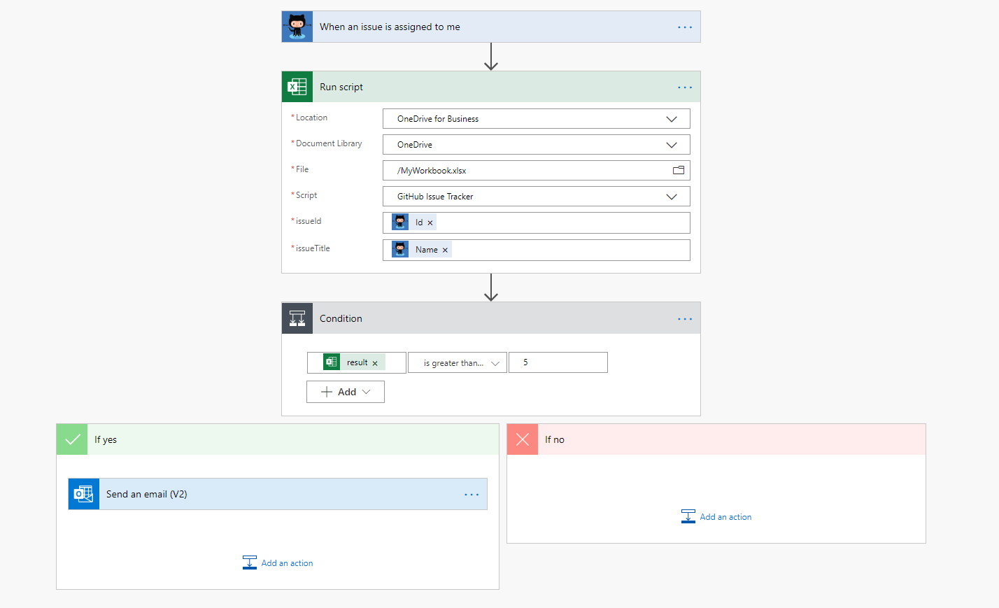

# <a name="run-office-scripts-with-power-automate"></a><span data-ttu-id="ab0e2-103">Executar scripts do Office com automatização de energia</span><span class="sxs-lookup"><span data-stu-id="ab0e2-103">Run Office Scripts with Power Automate</span></span>

<span data-ttu-id="ab0e2-104">A [automatização de energia](https://flow.microsoft.com) permite que você adicione scripts do Office a um fluxo de trabalho maior e automatizado.</span><span class="sxs-lookup"><span data-stu-id="ab0e2-104">[Power Automate](https://flow.microsoft.com) lets you add Office Scripts to a larger, automated workflow.</span></span> <span data-ttu-id="ab0e2-105">Você pode usar a automatização de energia, como adicionar o conteúdo de um email à tabela de uma planilha ou criar ações em suas ferramentas de gerenciamento de projeto com base nos comentários da pasta de trabalho.</span><span class="sxs-lookup"><span data-stu-id="ab0e2-105">You can use Power Automate do things like add the contents of an email to a worksheet's table or create actions in your project management tools based on workbook comments.</span></span>

## <a name="getting-started"></a><span data-ttu-id="ab0e2-106">Introdução</span><span class="sxs-lookup"><span data-stu-id="ab0e2-106">Getting started</span></span>

<span data-ttu-id="ab0e2-107">Se você for novo para a automatização de energia, recomendamos [a visita de introdução à automatização de energia](/power-automate/getting-started).</span><span class="sxs-lookup"><span data-stu-id="ab0e2-107">If you are new to Power Automate, we recommend visiting [Get started with Power Automate](/power-automate/getting-started).</span></span> <span data-ttu-id="ab0e2-108">Lá, você pode saber mais sobre todas as possibilidades de automação disponíveis para você.</span><span class="sxs-lookup"><span data-stu-id="ab0e2-108">There, you can learn more about all the automation possibilities available to you.</span></span> <span data-ttu-id="ab0e2-109">Os documentos aqui se concentram em como os scripts do Office trabalham com a automatização de energia e como isso pode ajudar a melhorar a experiência do Excel.</span><span class="sxs-lookup"><span data-stu-id="ab0e2-109">The documents here focus on how Office Scripts work with Power Automate and how that can help improve your Excel experience.</span></span>

<span data-ttu-id="ab0e2-110">Para começar a combinar os scripts do Office e automatizados de energia, siga o tutorial [começar a usar scripts com a automatização de energia](../tutorials/excel-power-automate-manual.md).</span><span class="sxs-lookup"><span data-stu-id="ab0e2-110">To begin combining Power Automate and Office Scripts, follow the tutorial [Start using scripts with Power Automate](../tutorials/excel-power-automate-manual.md).</span></span> <span data-ttu-id="ab0e2-111">Isso ensina como criar um fluxo que chama um script simples.</span><span class="sxs-lookup"><span data-stu-id="ab0e2-111">This will teach you how to create a flow that calls a simple script.</span></span> <span data-ttu-id="ab0e2-112">Após concluir o tutorial e a passagem dos [dados para scripts em um tutorial de fluxo automático automatizado de energia automatizada](../tutorials/excel-power-automate-trigger.md) , retorne aqui para obter informações detalhadas sobre como conectar scripts do Office para automatizar fluxos de energia.</span><span class="sxs-lookup"><span data-stu-id="ab0e2-112">After you've completed that tutorial and the [Pass data to scripts in an automatically-run Power Automate flow](../tutorials/excel-power-automate-trigger.md) tutorial, return here for detailed information about connecting Office Scripts to Power Automate flows.</span></span>

## <a name="excel-online-business-connector"></a><span data-ttu-id="ab0e2-113">Conector do Excel online (comercial)</span><span class="sxs-lookup"><span data-stu-id="ab0e2-113">Excel Online (Business) connector</span></span>

<span data-ttu-id="ab0e2-114">Os [conectores](/connectors/connectors) são as pontes entre automatização e aplicativos.</span><span class="sxs-lookup"><span data-stu-id="ab0e2-114">[Connectors](/connectors/connectors) are the bridges between Power Automate and applications.</span></span> <span data-ttu-id="ab0e2-115">O [conector do Excel online (Business)](/connectors/excelonlinebusiness) fornece aos seus fluxos acesso às pastas de trabalho do Excel.</span><span class="sxs-lookup"><span data-stu-id="ab0e2-115">The [Excel Online (Business) connector](/connectors/excelonlinebusiness) gives your flows access to Excel workbooks.</span></span> <span data-ttu-id="ab0e2-116">A ação "executar script" permite chamar qualquer script do Office acessível por meio da pasta de trabalho selecionada.</span><span class="sxs-lookup"><span data-stu-id="ab0e2-116">The "Run script" action lets you call any Office Script accessible through the selected workbook.</span></span> <span data-ttu-id="ab0e2-117">Não só é possível executar scripts por meio de um fluxo, você pode passar dados de e para a pasta de trabalho com o fluxo pelos scripts.</span><span class="sxs-lookup"><span data-stu-id="ab0e2-117">Not only can you run scripts through a flow, you can pass data to and from the workbook with the flow through the scripts.</span></span>

> [!IMPORTANT]
> <span data-ttu-id="ab0e2-118">A ação "executar script" fornece às pessoas que usam o conector Excel acesso significativo à sua pasta de trabalho e seus dados.</span><span class="sxs-lookup"><span data-stu-id="ab0e2-118">The "Run script" action gives people who use the Excel connector significant access to your workbook and its data.</span></span> <span data-ttu-id="ab0e2-119">Além disso, há riscos de segurança com scripts que fazem chamadas à API externa, conforme explicado em [chamadas externas da automatização de energia](external-calls.md).</span><span class="sxs-lookup"><span data-stu-id="ab0e2-119">Additionally, there are security risks with scripts that make external API calls, as explained in [External calls from Power Automate](external-calls.md).</span></span> <span data-ttu-id="ab0e2-120">Se seu administrador estiver preocupado com a exposição de dados altamente confidenciais, eles poderão desativar o conector do Excel online ou restringir o acesso a scripts do Office por meio dos [controles de administrador de scripts do Office](https://support.microsoft.com/office/19d3c51a-6ca2-40ab-978d-60fa49554dcf).</span><span class="sxs-lookup"><span data-stu-id="ab0e2-120">If your admin is concerned with the exposure of highly sensitive data, they can either turn off the Excel Online connector or restrict access to Office Scripts through the [Office Scripts administrator controls](https://support.microsoft.com/office/19d3c51a-6ca2-40ab-978d-60fa49554dcf).</span></span>

## <a name="data-transfer-in-flows-for-scripts"></a><span data-ttu-id="ab0e2-121">Transferência de dados em fluxos para scripts</span><span class="sxs-lookup"><span data-stu-id="ab0e2-121">Data transfer in flows for scripts</span></span>

<span data-ttu-id="ab0e2-122">A automatização de energia permite que você passe dados entre as etapas do seu fluxo.</span><span class="sxs-lookup"><span data-stu-id="ab0e2-122">Power Automate lets you pass pieces of data between steps of your flow.</span></span> <span data-ttu-id="ab0e2-123">Os scripts podem ser configurados para aceitar qualquer tipo de informação que você precisa e retornar qualquer coisa da sua pasta de trabalho que você deseja em seu fluxo.</span><span class="sxs-lookup"><span data-stu-id="ab0e2-123">Scripts can be configured to accept whatever types of information you need and return anything from your workbook that you want in your flow.</span></span> <span data-ttu-id="ab0e2-124">A entrada para o seu script é especificada adicionando parâmetros à `main` função (além de `workbook: ExcelScript.Workbook` ).</span><span class="sxs-lookup"><span data-stu-id="ab0e2-124">Input for your script is specified by adding parameters to the `main` function (in addition to `workbook: ExcelScript.Workbook`).</span></span> <span data-ttu-id="ab0e2-125">A saída do script é declarada pela adição de um tipo de retorno a `main` .</span><span class="sxs-lookup"><span data-stu-id="ab0e2-125">Output from the script is declared by adding a return type to `main`.</span></span>

> [!NOTE]
> <span data-ttu-id="ab0e2-126">Quando você cria um bloco de "script de execução" em seu fluxo, os parâmetros aceitos e os tipos retornados são preenchidos.</span><span class="sxs-lookup"><span data-stu-id="ab0e2-126">When you create a "Run Script" block in your flow, the accepted parameters and returned types are populated.</span></span> <span data-ttu-id="ab0e2-127">Se você alterar os parâmetros ou retornar tipos de seu script, será necessário refazer o bloco "executar script" do seu fluxo.</span><span class="sxs-lookup"><span data-stu-id="ab0e2-127">If you change the parameters or return types of your script, you'll need to redo the "Run script" block of your flow.</span></span> <span data-ttu-id="ab0e2-128">Isso garante que os dados estão sendo analisados corretamente.</span><span class="sxs-lookup"><span data-stu-id="ab0e2-128">This ensures the data is being parsed correctly.</span></span>

<span data-ttu-id="ab0e2-129">As seções a seguir abrangem os detalhes de entrada e saída para scripts usados na automatização de energia.</span><span class="sxs-lookup"><span data-stu-id="ab0e2-129">The following sections cover the details of input and output for scripts used in Power Automate.</span></span> <span data-ttu-id="ab0e2-130">Se você gostaria de obter uma abordagem prática para aprender este tópico, experimente os dados de [passagem para scripts em um tutorial de fluxo automático automatizado de fluxo](../tutorials/excel-power-automate-trigger.md) automático ou explore o cenário de exemplo de [lembretes automáticos de tarefas](../resources/scenarios/task-reminders.md) .</span><span class="sxs-lookup"><span data-stu-id="ab0e2-130">If you'd like a hands-on approach to learning this topic, try out the [Pass data to scripts in an automatically-run Power Automate flow](../tutorials/excel-power-automate-trigger.md) tutorial or explore the [Automated task reminders](../resources/scenarios/task-reminders.md) sample scenario.</span></span>

### <a name="main-parameters-passing-data-to-a-script"></a><span data-ttu-id="ab0e2-131">`main`Parâmetros: passagem de dados para um script</span><span class="sxs-lookup"><span data-stu-id="ab0e2-131">`main` Parameters: Passing data to a script</span></span>

<span data-ttu-id="ab0e2-132">Todas as entradas de script são especificadas como parâmetros adicionais para a `main` função.</span><span class="sxs-lookup"><span data-stu-id="ab0e2-132">All script input is specified as additional parameters for the `main` function.</span></span> <span data-ttu-id="ab0e2-133">Por exemplo, se você quisesse que um script aceita um `string` que representa um nome como entrada, você alteraria a `main` assinatura para `function main(workbook: ExcelScript.Workbook, name: string)` .</span><span class="sxs-lookup"><span data-stu-id="ab0e2-133">For example, if you wanted a script to accept a `string` that represents a name as input, you would change the `main` signature to `function main(workbook: ExcelScript.Workbook, name: string)`.</span></span>

<span data-ttu-id="ab0e2-134">Quando você estiver configurando um fluxo em automatização de energia, poderá especificar a entrada de script como valores estáticos, [expressões](/power-automate/use-expressions-in-conditions)ou conteúdo dinâmico.</span><span class="sxs-lookup"><span data-stu-id="ab0e2-134">When you're configuring a flow in Power Automate, you can specify script input as static values, [expressions](/power-automate/use-expressions-in-conditions), or dynamic content.</span></span> <span data-ttu-id="ab0e2-135">Os detalhes sobre o conector de um serviço individual podem ser encontrados na [documentação do conector automatizado de energia](/connectors/).</span><span class="sxs-lookup"><span data-stu-id="ab0e2-135">Details on an individual service's connector can be found in the [Power Automate Connector documentation](/connectors/).</span></span>

<span data-ttu-id="ab0e2-136">Ao adicionar parâmetros de entrada para a função de um script `main` , considere as seguintes permissões e restrições.</span><span class="sxs-lookup"><span data-stu-id="ab0e2-136">When adding input parameters to a script's `main` function, consider the following allowances and restrictions.</span></span>

1. <span data-ttu-id="ab0e2-137">O primeiro parâmetro deve ser do tipo `ExcelScript.Workbook` .</span><span class="sxs-lookup"><span data-stu-id="ab0e2-137">The first parameter must be of type `ExcelScript.Workbook`.</span></span> <span data-ttu-id="ab0e2-138">O nome do parâmetro não importa.</span><span class="sxs-lookup"><span data-stu-id="ab0e2-138">Its parameter name does not matter.</span></span>

2. <span data-ttu-id="ab0e2-139">Todo parâmetro deve ter um tipo.</span><span class="sxs-lookup"><span data-stu-id="ab0e2-139">Every parameter must have a type.</span></span>

3. <span data-ttu-id="ab0e2-140">Os tipos básicos,,,,, `string` `number` `boolean` `any` `unknown` `object` e `undefined` são suportados.</span><span class="sxs-lookup"><span data-stu-id="ab0e2-140">The basic types `string`, `number`, `boolean`, `any`, `unknown`, `object`, and `undefined` are supported.</span></span>

4. <span data-ttu-id="ab0e2-141">Há suporte para matrizes dos tipos básicos listados anteriormente.</span><span class="sxs-lookup"><span data-stu-id="ab0e2-141">Arrays of the previously listed basic types are supported.</span></span>

5. <span data-ttu-id="ab0e2-142">Há suporte para matrizes aninhadas como parâmetros (mas não como tipos de retorno).</span><span class="sxs-lookup"><span data-stu-id="ab0e2-142">Nested arrays are supported as parameters (but not as return types).</span></span>

6. <span data-ttu-id="ab0e2-143">Os tipos de União são permitidos se eles forem uma União de literais pertencentes a um único tipo ( `string` , `number` , ou `boolean` ).</span><span class="sxs-lookup"><span data-stu-id="ab0e2-143">Union types are allowed if they are a union of literals belonging to a single type (`string`, `number`, or `boolean`).</span></span> <span data-ttu-id="ab0e2-144">Também há suporte para Undefined de um tipo com suporte.</span><span class="sxs-lookup"><span data-stu-id="ab0e2-144">Unions of a supported type with undefined are also supported.</span></span>

7. <span data-ttu-id="ab0e2-145">Os tipos de objeto são permitidos se contiverem Propriedades de tipo `string` , `number` , `boolean` matrizes com suporte ou outros objetos com suporte.</span><span class="sxs-lookup"><span data-stu-id="ab0e2-145">Object types are allowed if they contain properties of type `string`, `number`, `boolean`, supported arrays, or other supported objects.</span></span> <span data-ttu-id="ab0e2-146">O exemplo a seguir mostra objetos aninhados suportados como tipos de parâmetros:</span><span class="sxs-lookup"><span data-stu-id="ab0e2-146">The following example shows nested objects that are supported as parameter types:</span></span>

    ```TypeScript
    // Office Scripts can return an Employee object because Position only contains strings and numbers.
    interface Employee {
        name: string;
        job: Position;
    }

    interface Position {
        id: number;
        title: string;
    }
    ```

8. <span data-ttu-id="ab0e2-147">Os objetos devem ter sua definição de interface ou de classe definida no script.</span><span class="sxs-lookup"><span data-stu-id="ab0e2-147">Objects must have their interface or class definition defined in the script.</span></span> <span data-ttu-id="ab0e2-148">Um objeto também pode ser definido de forma anônima, como no exemplo a seguir:</span><span class="sxs-lookup"><span data-stu-id="ab0e2-148">An object can also be defined anonymously inline, as in the following example:</span></span>

    ```TypeScript
    function main(workbook: ExcelScript.Workbook): {name: string, email: string}
    ```

9. <span data-ttu-id="ab0e2-149">Parâmetros opcionais são permitidos e podem ser indicados por meio do modificador opcional `?` (por exemplo, `function main(workbook: ExcelScript.Workbook, Name?: string)` ).</span><span class="sxs-lookup"><span data-stu-id="ab0e2-149">Optional parameters are allowed and can be denoted as such by using the optional modifier `?` (for example, `function main(workbook: ExcelScript.Workbook, Name?: string)`).</span></span>

10. <span data-ttu-id="ab0e2-150">Os valores de parâmetro padrão são permitidos (por exemplo `async function main(workbook: ExcelScript.Workbook, Name: string = 'Jane Doe')` .</span><span class="sxs-lookup"><span data-stu-id="ab0e2-150">Default parameter values are allowed (for example `async function main(workbook: ExcelScript.Workbook, Name: string = 'Jane Doe')`.</span></span>

### <a name="returning-data-from-a-script"></a><span data-ttu-id="ab0e2-151">Retornar dados de um script</span><span class="sxs-lookup"><span data-stu-id="ab0e2-151">Returning data from a script</span></span>

<span data-ttu-id="ab0e2-152">Os scripts podem retornar dados da pasta de trabalho para serem usados como conteúdo dinâmico em um fluxo automatizado de energia.</span><span class="sxs-lookup"><span data-stu-id="ab0e2-152">Scripts can return data from the workbook to be used as dynamic content in a Power Automate flow.</span></span> <span data-ttu-id="ab0e2-153">Como nos parâmetros de entrada, a automatização de energia coloca algumas restrições no tipo de retorno.</span><span class="sxs-lookup"><span data-stu-id="ab0e2-153">As with input parameters, Power Automate places some restrictions on the return type.</span></span>

1. <span data-ttu-id="ab0e2-154">Os tipos básicos `string` , `number` , `boolean` , `void` e `undefined` são suportados.</span><span class="sxs-lookup"><span data-stu-id="ab0e2-154">The basic types `string`, `number`, `boolean`, `void`, and `undefined` are supported.</span></span>

2. <span data-ttu-id="ab0e2-155">Tipos de União usados como tipos de retorno seguem as mesmas restrições que eles fazem quando usados como parâmetros de script.</span><span class="sxs-lookup"><span data-stu-id="ab0e2-155">Union types used as return types follow the same restrictions as they do when used as script parameters.</span></span>

3. <span data-ttu-id="ab0e2-156">Tipos de matriz são permitidos se forem do tipo `string` , `number` ou `boolean` .</span><span class="sxs-lookup"><span data-stu-id="ab0e2-156">Array types are allowed if they are of type `string`, `number`, or `boolean`.</span></span> <span data-ttu-id="ab0e2-157">Eles também são permitidos se o tipo for um tipo de União ou tipo literal suportado.</span><span class="sxs-lookup"><span data-stu-id="ab0e2-157">They are also allowed if the type is a supported union or supported literal type.</span></span>

4. <span data-ttu-id="ab0e2-158">Tipos de objeto usados como tipos de retorno seguem as mesmas restrições que eles fazem quando usados como parâmetros de script.</span><span class="sxs-lookup"><span data-stu-id="ab0e2-158">Object types used as return types follow the same restrictions as they do when used as script parameters.</span></span>

5. <span data-ttu-id="ab0e2-159">Há suporte para digitação implícita, embora seja necessário seguir as mesmas regras que um tipo definido.</span><span class="sxs-lookup"><span data-stu-id="ab0e2-159">Implicit typing is supported, though it must follow the same rules as a defined type.</span></span>

## <a name="avoid-using-relative-references"></a><span data-ttu-id="ab0e2-160">Evitar o uso de referências relativas</span><span class="sxs-lookup"><span data-stu-id="ab0e2-160">Avoid using relative references</span></span>

<span data-ttu-id="ab0e2-161">A automatização de energia executa o script na pasta de trabalho do Excel escolhida em seu nome.</span><span class="sxs-lookup"><span data-stu-id="ab0e2-161">Power Automate runs your script in the chosen Excel workbook on your behalf.</span></span> <span data-ttu-id="ab0e2-162">A pasta de trabalho pode ser fechada quando isso acontecer.</span><span class="sxs-lookup"><span data-stu-id="ab0e2-162">The workbook might be closed when this happens.</span></span> <span data-ttu-id="ab0e2-163">Qualquer API que se baseia no estado atual do usuário, como `Workbook.getActiveWorksheet` , falhará quando for executada através da automatização de energia.</span><span class="sxs-lookup"><span data-stu-id="ab0e2-163">Any API that relies on the user's current state, such as `Workbook.getActiveWorksheet`, will fail when run through Power Automate.</span></span> <span data-ttu-id="ab0e2-164">Ao projetar seus scripts, certifique-se de usar referências absolutas para planilhas e intervalos.</span><span class="sxs-lookup"><span data-stu-id="ab0e2-164">When designing your scripts, be sure to use absolute references for worksheets and ranges.</span></span>

<span data-ttu-id="ab0e2-165">Os métodos a seguir gerarão um erro e falharão quando chamados de um script em um fluxo automatizado de energia.</span><span class="sxs-lookup"><span data-stu-id="ab0e2-165">The following methods will throw an error and fail when called from a script in a Power Automate flow.</span></span>

| <span data-ttu-id="ab0e2-166">Classe</span><span class="sxs-lookup"><span data-stu-id="ab0e2-166">Class</span></span> | <span data-ttu-id="ab0e2-167">Método</span><span class="sxs-lookup"><span data-stu-id="ab0e2-167">Method</span></span> |
|--|--|
| [<span data-ttu-id="ab0e2-168">Gráfico</span><span class="sxs-lookup"><span data-stu-id="ab0e2-168">Chart</span></span>](/javascript/api/office-scripts/excelscript/excelscript.chart) | `activate` |
| [<span data-ttu-id="ab0e2-169">Range</span><span class="sxs-lookup"><span data-stu-id="ab0e2-169">Range</span></span>](/javascript/api/office-scripts/excelscript/excelscript.range) | `select` |
| [<span data-ttu-id="ab0e2-170">Pasta de trabalho</span><span class="sxs-lookup"><span data-stu-id="ab0e2-170">Workbook</span></span>](/javascript/api/office-scripts/excelscript/excelscript.workbook) | `getActiveCell` |
| [<span data-ttu-id="ab0e2-171">Pasta de trabalho</span><span class="sxs-lookup"><span data-stu-id="ab0e2-171">Workbook</span></span>](/javascript/api/office-scripts/excelscript/excelscript.workbook) | `getActiveChart` |
| [<span data-ttu-id="ab0e2-172">Pasta de trabalho</span><span class="sxs-lookup"><span data-stu-id="ab0e2-172">Workbook</span></span>](/javascript/api/office-scripts/excelscript/excelscript.workbook) | `getActiveSlicer` |
| [<span data-ttu-id="ab0e2-173">Pasta de trabalho</span><span class="sxs-lookup"><span data-stu-id="ab0e2-173">Workbook</span></span>](/javascript/api/office-scripts/excelscript/excelscript.workbook) | `getActiveWorksheet` |
| [<span data-ttu-id="ab0e2-174">Pasta de trabalho</span><span class="sxs-lookup"><span data-stu-id="ab0e2-174">Workbook</span></span>](/javascript/api/office-scripts/excelscript/excelscript.workbook) | `getSelectedRange` |
| [<span data-ttu-id="ab0e2-175">Pasta de trabalho</span><span class="sxs-lookup"><span data-stu-id="ab0e2-175">Workbook</span></span>](/javascript/api/office-scripts/excelscript/excelscript.workbook) | `getSelectedRanges` |
| [<span data-ttu-id="ab0e2-176">Planilha</span><span class="sxs-lookup"><span data-stu-id="ab0e2-176">Worksheet</span></span>](/javascript/api/office-scripts/excelscript/excelscript.workbook) | `activate` |

## <a name="example"></a><span data-ttu-id="ab0e2-177">Exemplo</span><span class="sxs-lookup"><span data-stu-id="ab0e2-177">Example</span></span>

<span data-ttu-id="ab0e2-178">A captura de tela a seguir mostra um fluxo automatizado de energia que é disparado sempre que um problema do [GitHub](https://github.com/) é atribuído a você.</span><span class="sxs-lookup"><span data-stu-id="ab0e2-178">The following screenshot shows a Power Automate flow that's triggered whenever a [GitHub](https://github.com/) issue is assigned to you.</span></span> <span data-ttu-id="ab0e2-179">O fluxo executa um script que adiciona o problema a uma tabela em uma pasta de trabalho do Excel.</span><span class="sxs-lookup"><span data-stu-id="ab0e2-179">The flow runs a script that adds the issue to a table in an Excel workbook.</span></span> <span data-ttu-id="ab0e2-180">Se houver cinco ou mais problemas nessa tabela, o fluxo enviará um lembrete por email.</span><span class="sxs-lookup"><span data-stu-id="ab0e2-180">If there are five or more issues in that table, the flow sends an email reminder.</span></span>



<span data-ttu-id="ab0e2-182">A `main` função do script especifica a ID do problema e o título do problema como parâmetros de entrada, e o script retorna o número de linhas na tabela de saída.</span><span class="sxs-lookup"><span data-stu-id="ab0e2-182">The `main` function of the script specifies the issue ID and issue title as input parameters, and the script returns the number of rows in the issue table.</span></span>

```TypeScript
function main(
  workbook: ExcelScript.Workbook,
  issueId: string,
  issueTitle: string): number {
  // Get the "GitHub" worksheet.
  let worksheet = workbook.getWorksheet("GitHub");

  // Get the first table in this worksheet, which contains the table of GitHub issues.
  let issueTable = worksheet.getTables()[0];

  // Add the issue ID and issue title as a row.
  issueTable.addRow(-1, [issueId, issueTitle]);

  // Return the number of rows in the table, which represents how many issues are assigned to this user.
  return issueTable.getRangeBetweenHeaderAndTotal().getRowCount();
}
```

## <a name="see-also"></a><span data-ttu-id="ab0e2-183">Confira também</span><span class="sxs-lookup"><span data-stu-id="ab0e2-183">See also</span></span>

- [<span data-ttu-id="ab0e2-184">Executar scripts do Office no Excel na Web com a automatização de energia</span><span class="sxs-lookup"><span data-stu-id="ab0e2-184">Run Office Scripts in Excel on the web with Power Automate</span></span>](../tutorials/excel-power-automate-manual.md)
- [<span data-ttu-id="ab0e2-185">Transmitir dados para scripts em um fluxo automático de energia de execução automatizada</span><span class="sxs-lookup"><span data-stu-id="ab0e2-185">Pass data to scripts in an automatically-run Power Automate flow</span></span>](../tutorials/excel-power-automate-trigger.md)
- [<span data-ttu-id="ab0e2-186">Fundamentos de script para scripts do Office no Excel na Web</span><span class="sxs-lookup"><span data-stu-id="ab0e2-186">Scripting fundamentals for Office Scripts in Excel on the web</span></span>](scripting-fundamentals.md)
- [<span data-ttu-id="ab0e2-187">Começar a usar o Power Automate</span><span class="sxs-lookup"><span data-stu-id="ab0e2-187">Get started with Power Automate</span></span>](/power-automate/getting-started)
- [<span data-ttu-id="ab0e2-188">Documentação de referência do conector do Excel online (Business)</span><span class="sxs-lookup"><span data-stu-id="ab0e2-188">Excel Online (Business) connector reference documentation</span></span>](/connectors/excelonlinebusiness/)
