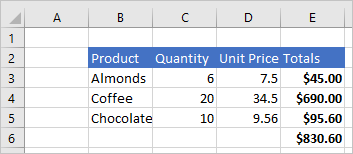
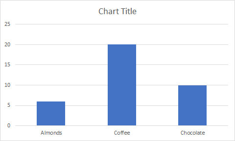

# <a name="scripting-fundamentals-for-office-scripts-in-excel-on-the-web-preview"></a>Fundamentos de script para scripts do Office no Excel na Web (visualização)

Este artigo apresentará os aspectos técnicos dos scripts do Office. Você saberá como os objetos do Excel funcionam em conjunto e como o editor de código se sincroniza com uma pasta de trabalho.

[!INCLUDE [Preview note](../includes/preview-note.md)]

## <a name="object-model"></a>Modelo de objetos

Para entender as APIs do Excel, você deve entender como os componentes de uma pasta de trabalho estão relacionados entre si.

- Uma **Pasta de trabalho** contém uma ou mais **Planilhas**.
- Uma **Planilha** concede acesso a células por meio de objetos de **Intervalo**.
- Um **Intervalo** representa um grupo de células contíguas.
- Os **Intervalos** são usados para criar e colocar **Tabelas**, **Gráficos**, **Formas** e outras visualizações de dados ou objetos da organização.
- Uma **Planilha** contém coleções desses objetos de dados que estão presentes na planilha individual.
- As **Pastas de trabalho** contêm coleções de alguns desses objetos de dados (por exemplo, **Tabelas**) para toda a **Pasta de trabalho**.

### <a name="ranges"></a>Intervalos

Um intervalo é um grupo de células contíguas na pasta de trabalho. Os scripts geralmente usam a notação de estilo A1 (por exemplo, **B3** para a única célula na linha **B** e coluna **3** ou **C2:F4** para as células das linhas **C** a **F** e colunas **2** a **4**) para definir intervalos.

Os intervalos têm três propriedades principais: `values`, `formulas` e `format`. Essas propriedades recebem ou definem os valores da célula, as fórmulas a serem avaliadas e a formatação visual das células.

#### <a name="range-sample"></a>Exemplo de intervalo

O exemplo a seguir mostra como criar registros de vendas. Esse script usa objetos `Range` para definir os valores, fórmulas e formatos.

```TypeScript
async function main(context: Excel.RequestContext) {
  // Get the active worksheet.
  let sheet = context.workbook.worksheets.getActiveWorksheet();

  // Create the headers and format them to stand out.
  let headers = [
    ["Product", "Quantity", "Unit Price", "Totals"]
  ];
  let headerRange = sheet.getRange("B2:E2");
  headerRange.values = headers;
  headerRange.format.fill.color = "#4472C4";
  headerRange.format.font.color = "white";

  // Create the product data rows.
  let productData = [
    ["Almonds", 6, 7.5],
    ["Coffee", 20, 34.5],
    ["Chocolate", 10, 9.56],
  ];
  let dataRange = sheet.getRange("B3:D5");
  dataRange.values = productData;

  // Create the formulas to total the amounts sold.
  let totalFormulas = [
    ["=C3 * D3"],
    ["=C4 * D4"],
    ["=C5 * D5"],
    ["=SUM(E3:E5)"]
  ];
  let totalRange = sheet.getRange("E3:E6");
  totalRange.formulas = totalFormulas;
  totalRange.format.font.bold = true;

  // Display the totals as US dollar amounts.
  totalRange.numberFormat = [["$0.00"]];
}
```

Executar este script cria os seguintes dados na planilha atual:



### <a name="charts-tables-and-other-data-objects"></a>Gráficos, tabelas e outros objetos de dados

Os scripts podem criar e manipular estruturas de dados e visualizações no Excel. As tabelas e gráficos são dois dos objetos mais usados, mas as APIs oferecem suporte a tabelas dinâmicas, formas, imagens e muito mais.

#### <a name="creating-a-table"></a>Criar uma tabela

Criar tabelas usando intervalos de dados preenchidos. Controles de formatação e tabela (por exemplo, filtros) são aplicados automaticamente ao intervalo.

O script a seguir cria uma tabela usando os intervalos do exemplo anterior.

```TypeScript
async function main(context: Excel.RequestContext) {
   let sheet = context.workbook.worksheets.getActiveWorksheet();
   sheet.tables.add("B2:E5", true);
}
```

Executar esse script na planilha com os dados anteriores cria a tabela a seguir:


#### <a name="creating-a-chart"></a>Criar um gráfico

Crie gráficos para visualizar os dados em um intervalo. Os scripts permitem inúmeras variedades de gráficos que podem ser personalizadas de acordo com suas necessidades.

O script a seguir cria um gráfico de colunas simples para três itens e o coloca 100 pixels abaixo da parte superior da planilha.

```TypeScript
async function main(context: Excel.RequestContext) {
  let sheet = context.workbook.worksheets.getActiveWorksheet();
  let chart = sheet.charts.add(Excel.ChartType.columnStacked, sheet.getRange("B3:C5"));
  chart.top = 100;
}
```

Executar este script na planilha com a tabela anterior cria o seguinte gráfico:



### <a name="further-reading-on-the-object-model"></a>Leituras adicionais sobre o modelo de objeto

A [documentação de referência de API dos scripts do Office](/javascript/api/office-scripts/overview) é uma lista completa dos objetos usados nos scripts do Office. Lá, você pode usar o sumário para navegar para qualquer classe da qual quiser saber mais. Estas são várias páginas exibidas com frequência.

- [Gráfico](/javascript/api/office-scripts/excel/excel.chart)
- [Comentário](/javascript/api/office-scripts/excel/excel.comment)
- [PivotTable](/javascript/api/office-scripts/excel/excel.pivottable)
- [Range](/javascript/api/office-scripts/excel/excel.range)
- [RangeFormat](/javascript/api/office-scripts/excel/excel.rangeformat)
- [Formato](/javascript/api/office-scripts/excel/excel.shape)
- [Table](/javascript/api/office-scripts/excel/excel.table)
- [Pasta de trabalho](/javascript/api/office-scripts/excel/excel.workbook)
- [Planilha](/javascript/api/office-scripts/excel/excel.worksheet)

## <a name="main-function"></a>função `main`

Todos os scripts do Office devem conter uma função `main` com a seguinte assinatura, incluindo a definição de tipo `Excel.RequestContext`:

```TypeScript
async function main(context: Excel.RequestContext) {
    // Your Excel Script
}
```

O código dentro da função `main` é executado quando o script é executado. `main` pode chamar outras funções em seu script, mas o código que não estiver contido em uma função não será executado.

## <a name="context"></a>Contexto

A função `main` aceita um parâmetro `Excel.RequestContext`, chamado `context`. Imagine `context` como a ponte entre o seu script e a pasta de trabalho. Seu script acessa a pasta de trabalho com o objeto `context` e usa esse `context` para troca de dados.

O objeto `context` é necessário porque o script e o Excel estão sendo executados em processos e locais diferentes. O script precisará fazer alterações ou consultar dados da pasta de trabalho na nuvem. O objeto `context` gerencia essas transações.

## <a name="sync-and-load"></a>Sincronizar e carregar

Como o seu script e a pasta de trabalho são executados em locais diferentes, qualquer transferência de dados entre os dois levará algum tempo. Para melhorar o desempenho do script, os comandos são enfileirados até que o script chame explicitamente a operação `sync` para sincronizar o script e a pasta de trabalho. Seu script pode trabalhar de forma independente até que precise executar uma das seguintes ações:

- Ler dados da pasta de trabalho (após uma operação `load`).
- Gravar dados na pasta de trabalho (geralmente porque o script terminou).

A imagem a seguir mostra um exemplo de fluxo de controle entre o script e a pasta de trabalho:


### <a name="sync"></a>Sincronizar

Sempre que o seu script precisa ler ou gravar dados na pasta de trabalho, chame o método `RequestContext.sync`, conforme mostrado aqui:

```TypeScript
await context.sync();
```

> [!NOTE]
> `context.sync()` é chamado implicitamente quando um script termina.

Após a conclusão da operação `sync`, a pasta de trabalho será atualizada para refletir as operações de gravação especificados por esse script. Uma operação de gravação está definindo uma propriedade em um objeto do Excel (por exemplo, `range.format.fill.color = "red"`) ou chamando um método que altera uma propriedade (por exemplo, `range.format.autoFitColumns()`). A operação `sync` também lê os valores da pasta de trabalho que o script solicitou usando uma operação `load` (conforme discutido na próxima seção).

A sincronização do seu script com a pasta de trabalho pode demorar, dependendo da sua rede. Você deve minimizar o número de chamadas `sync` para ajudar seu script a ser executado rapidamente.  

### <a name="load"></a>Carregar

Um script deve carregar os dados da pasta de trabalho antes de lê-los. No entanto, o carregamento frequente de dados de uma pasta de trabalho reduz significativamente a velocidade do script. Em vez disso, o método `load` permite que o seu script indique especificamente quais dados devem ser recuperados da pasta de trabalho.

O método `load` está disponível em todos os objetos do Excel. Seu script deve carregar as propriedades de um objeto para poder lê-lo. Se isso não for feito, ocorrerá um erro.

Os exemplos a seguir usam um objeto `Range` para mostrar as três maneiras de usar o método `load` para carregar dados.

|Finalidade |Comando de exemplo | Efeito |
|:--|:--|:--|
|Carregar uma propriedade |`myRange.load("values");` | Carrega uma única propriedade, neste caso, a matriz bidimensional de valores nesse intervalo. |
|Carregar várias propriedades |`myRange.load("values, rowCount, columnCount");`| Carrega todas as propriedades de uma lista delimitada por vírgulas, neste exemplo, os valores, a contagem de linhas e de colunas. |
|Carregar tudo | `myRange.load();`|Carrega todas as propriedades no intervalo. Essa não é uma solução recomendada, uma vez que diminuirá a velocidade do seu script ao obter dados desnecessários. Você só deve usar isso enquanto testa seu script ou se precisar de todas as propriedades do objeto. |

Seu script deve chamar `context.sync()` antes de ler os valores carregados.

```TypeScript
let range = selectedSheet.getRange("A1:B3");
range.load ("rowCount"); // Load the property.
await context.sync(); // Synchronize with the workbook to get the property.
console.log(range.rowCount); // Read and log the property value (3).
```

Você também pode carregar as propriedades em uma coleção. Todos os objetos da coleção têm uma propriedade `items` que é uma matriz contendo os objetos dessa coleção. Usar `items` como o início de uma chamada hierárquica (`items\myProperty`) para `load` carrega as propriedades especificadas em cada um desses itens. O exemplo a seguir carrega a propriedade `resolved` em cada objeto `Comment` no objeto `CommentCollection` de uma planilha.

```TypeScript
let comments = selectedSheet.comments;
comments.load("items/resolved"); // Load the `resolved` property from every comment in this collection.
await context.sync(); // Synchronize with the workbook to get the properties.
```

> [!TIP]
> Para saber mais sobre como trabalhar com coleções nos scripts do Office, confira a seção Matriz do artigo [Usar objetos internos do JavaScript nos scripts do Office](javascript-objects.md#array).

## <a name="see-also"></a>Confira também

- [Gravar, editar e criar scripts do Office no Excel na Web](../tutorials/excel-tutorial.md)
- [Ler os dados da pasta de trabalho com scripts do Office no Excel na Web](../tutorials/excel-read-tutorial.md)
- [Referência da API de scripts do Office](/javascript/api/office-scripts/overview)
- [Usar objetos internos do JavaScript nos scripts do Office](javascript-objects.md)
