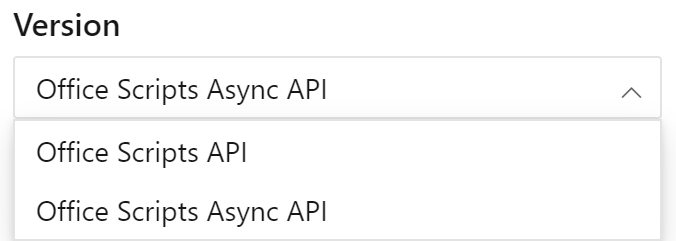

Use [este link para exibir a versão assíncrona da documentação de referência da API](/javascript/api/office-scripts/excelscript?view=office-scripts-async&preserve-view=true). Você pode alternar entre as APIs padrão e as versões assíncronas usando o controle de seleção de versão acima do Sumário na documentação de referência.

