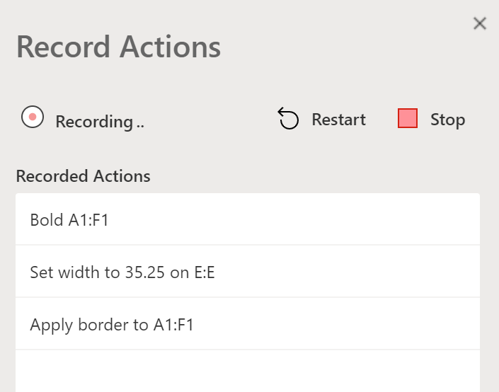
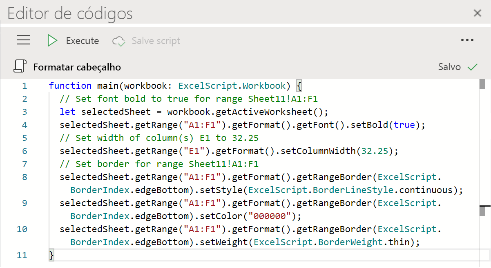

# Scripts do Office no Excel na Web (visualização)

Os scripts do Office no Excel na Web permitem automatizar suas tarefas diárias. Você pode gravar suas ações do Excel com o Gravador de ações, o qual cria um script. Você também pode criar e editar scripts com o Editor de códigos. Esta série de documentos ensina como usar essas ferramentas. Você será apresentado ao Gravador de ações e verá como gravar suas ações frequentes do Excel. Você também aprenderá a criar ou atualizar seus próprios scripts com o Editor de códigos.

 

> [!VIDEO https://www.microsoft.com/videoplayer/embed/RE4qdFF]

[!INCLUDE [Preview note](../includes/preview-note.md)]

## Quando usar scripts do Office

Os scripts permitem gravar e reproduzir suas ações do Excel em diferentes pastas de trabalho e planilhas. Se você se encontrar fazendo as mesmas coisas repetidamente, um Script do Office pode ajudá-lo, reduzindo todo o fluxo de trabalho a um único pressionar de botão.

Como exemplo, digamos que você comece seu dia de trabalho abrindo um arquivo .csv em um site de contabilidade no Excel. Então você gasta alguns minutos excluindo colunas desnecessárias, formatando uma tabela, adicionando fórmulas e criando uma tabela dinâmica em uma nova planilha. As ações repetidas diariamente podem ser gravadas uma vez com o Gravador de ações. A partir daí, a execução do script cuidará da sua conversão .csv. Além de remover o risco de esquecer as etapas, você poderá compartilhar seu processo com outras pessoas sem precisar ensinar nada a elas. Os scripts do Office automatizam suas tarefas comuns para que você e seu local de trabalho possam ser mais eficientes e produtivos.

## Gravador de ações

O Gravador de ações registra as ações que você executa no Excel e as converte em um script. Com o Gravador de ações em execução, você pode capturar as ações do Excel enquanto edita células, altera a formatação e cria tabelas. O script resultante pode ser executado em outras planilhas e pastas de trabalho para recriar suas ações originais.

## Editor de códigos

Todos os scripts gravados com o Gravador de ações podem ser editados através do Editor de códigos. Isso permite que você ajuste e personalize o script para melhor atender às suas necessidades. Você também pode adicionar lógica e funcionalidade que não são acessíveis de forma direta pela interface do usuário do Excel, como instruções condicionais (se/senão) e loops.

Uma maneira fácil de começar a aprender sobre os recursos dos scripts do Office é gravá-los no Excel na Web e exibir o código resultante. Outra opção é seguir nossos [tutoriais](../tutorials/excel-tutorial.md) para aprender de uma maneira mais guiada e estruturada.

## Próximas etapas

Conclua o [tutorial Scripts do Office no Excel na Web](../tutorials/excel-tutorial.md) para aprender como criar seus primeiros scripts do Office.

## Também confira

- [Fundamentos de script para script do Office no Excel na Web](../develop/scripting-fundamentals.md)
- [Referência da API de scripts do Office](/javascript/api/office-scripts/overview)
- [Solução de problemas dos scripts do Office](../testing/troubleshooting.md)
- [Configurações dos scripts do Office no M365](https://support.office.com/article/office-scripts-settings-in-m365-19d3c51a-6ca2-40ab-978d-60fa49554dcf)
- [Introdução aos scripts do Office no Excel (em support.office.com)](https://support.office.com/article/introduction-to-office-scripts-in-excel-9fbe283d-adb8-4f13-a75b-a81c6baf163a)
