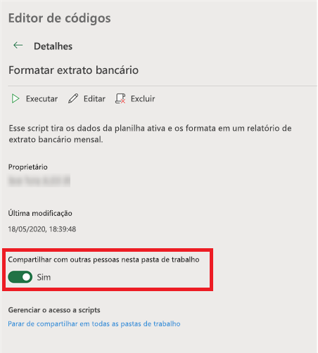

# Scripts do Office no Excel na Web (visualização)

Os scripts do Office no Excel na Web permitem automatizar suas tarefas diárias. Você pode gravar suas ações do Excel com o Gravador de ações, o qual cria um script. Você também pode criar e editar scripts com o Editor de códigos. Os scripts podem ser compartilhados com toda a organização, para que seus colegas possam automatizar os fluxos de trabalho.

Esta série de documentos ensina como usar essas ferramentas. Você será apresentado ao Gravador de ações e verá como gravar suas ações frequentes do Excel. Você também aprenderá a criar ou atualizar seus próprios scripts com o Editor de códigos.

 

> [!VIDEO https://www.microsoft.com/videoplayer/embed/RE4qdFF]

## Requisitos

[!INCLUDE [Preview note](../includes/preview-note.md)]

Para utilizar os Scripts do Office, você precisará do seguinte.

1. [Excel na web](https://www.office.com/launch/excel) (outras plataformas, como para desktop, não são suportadas).
1. Scripts do Office [habilitados pelo seu administrador](/microsoft-365/admin/manage/manage-office-scripts-settings).
1. Qualquer licença comercial ou educacional do Microsoft 365 com acesso aos aplicativos para desktop do Microsoft Office 365, como:

    - Office 365 Business
    - Office 365 Business Premium
    - Office 365 ProPlus
    - Office 365 ProPlus para dispositivos
    - Office 365 Enterprise E3
    - Office 365 Enterprise E5
    - Office 365 A3
    - Office 365 A5

## Quando usar scripts do Office

Os scripts permitem gravar e reproduzir suas ações do Excel em diferentes pastas de trabalho e planilhas. Se você perceber que vive fazendo as mesmas coisas o tempo inteiro, experimente transformar todo esse trabalho em um Script do Office fácil de executar. Execute seu script com um apertar de botão no Excel ou combine-o com o Power Automate para simplificar todo o fluxo de trabalho.

Como exemplo, digamos que você comece seu dia de trabalho abrindo um arquivo .csv em um site de contabilidade no Excel. Então você gasta alguns minutos excluindo colunas desnecessárias, formatando uma tabela, adicionando fórmulas e criando uma tabela dinâmica em uma nova planilha. As ações repetidas diariamente podem ser gravadas uma vez com o Gravador de ações. A partir daí, a execução do script cuidará da sua conversão .csv. Além de remover o risco de esquecer as etapas, você poderá compartilhar seu processo com outras pessoas sem precisar ensinar nada a elas. Os scripts do Office automatizam suas tarefas comuns para que você e seu local de trabalho possam ser mais eficientes e produtivos.

## Gravador de ações

O Gravador de Ações registra as ações que você executa no Excel e as salva na forma de um script. Com o Gravador de ações em execução, você pode capturar as ações do Excel enquanto edita células, altera a formatação e cria tabelas. O script resultante pode ser executado em outras planilhas e pastas de trabalho para recriar suas ações originais.

## Editor de códigos

Todos os scripts gravados com o Gravador de ações podem ser editados através do Editor de códigos. Isso permite que você ajuste e personalize o script para melhor atender às suas necessidades. Você também pode adicionar lógica e funcionalidade que não são acessíveis de forma direta pela interface do usuário do Excel, como instruções condicionais (se/senão) e loops.

Uma maneira fácil de começar a aprender sobre os recursos dos scripts do Office é gravá-los no Excel na Web e exibir o código resultante. Outra opção é seguir nossos [tutoriais](../tutorials/excel-tutorial.md) para aprender de uma maneira mais guiada e estruturada.

## Scripts de compartilhamento

Os scripts do Office podem ser compartilhados com outros usuários de uma pasta de trabalho do Excel. Quando você compartilha um script com outras pessoas em uma pasta de trabalho, o script é anexado àquela pasta. Seus scripts são armazenados no OneDrive e, quando você compartilha um, é possível criar um link para ele na pasta de trabalho que você abriu.

Mais detalhes sobre o compartilhamento e descompartilhamento de scripts são encontrados no artigo [Compartilhando scripts do Office no Excel para a Web](https://support.microsoft.com/office/sharing-office-scripts-in-excel-for-the-web-226eddbc-3a44-4540-acfe-fccda3d1122b?storagetype=live&ui=en-US&rs=en-US&ad=US).

## Conectando scripts do Office com o Power Automate

[O Power Automate](https://flow.microsoft.com/) é um serviço que ajuda você a criar fluxos de trabalho automatizados entre vários aplicativos e serviços. Os scripts do Office podem ser usados nesses fluxos de trabalho, permitindo que você controle seus scripts fora da pasta de trabalho. Você pode executar seus scripts em um cronograma, dispará-los em resposta a emails e muito mais. Visite o [Executar scripts do Office no Excel na Web com o tutorial do Power Automate](../tutorials/excel-power-automate-manual.md) para aprender como se conectar a esses serviços de automação.

## Próximas etapas

Conclua o [tutorial Scripts do Office no Excel na Web](../tutorials/excel-tutorial.md) para aprender como criar seus primeiros scripts do Office.

## Confira também

- [Fundamentos de script para scripts do Office no Excel na Web](../develop/scripting-fundamentals.md)
- [Referência da API de scripts do Office](/javascript/api/office-scripts/overview)
- [Solução de problemas dos scripts do Office](../testing/troubleshooting.md)
- [Configurações dos scripts do Office no M365](https://support.office.com/article/office-scripts-settings-in-m365-19d3c51a-6ca2-40ab-978d-60fa49554dcf)
- [Introdução aos scripts do Office no Excel (em support.office.com)](https://support.office.com/article/introduction-to-office-scripts-in-excel-9fbe283d-adb8-4f13-a75b-a81c6baf163a)
- [Compartilhando scripts do Office no Excel para a Web](https://support.microsoft.com/office/sharing-office-scripts-in-excel-for-the-web-226eddbc-3a44-4540-acfe-fccda3d1122b?storagetype=live&ui=en-US&rs=en-US&ad=US)
