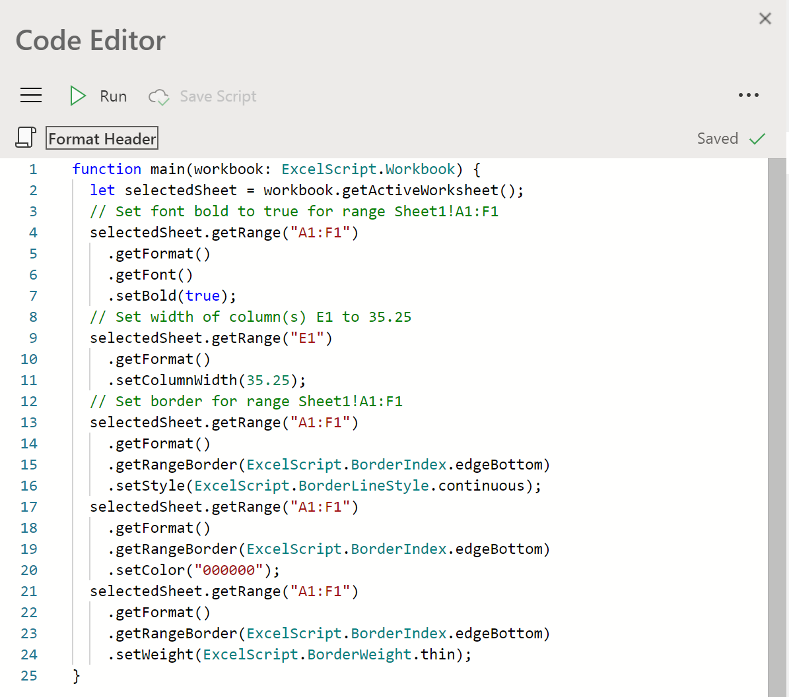

# Scripts do Office no Excel na Web (visualização)Office Scripts in Excel on the web (preview)

Os scripts do Office no Excel na Web permitem automatizar suas tarefas diárias.Office Scripts in Excel on the web let you automate your day-to-day tasks. Você pode gravar suas ações do Excel com o Gravador de ações, o qual cria um script.You can record your Excel actions with the Action Recorder, which creates a script. Você também pode criar e editar scripts com o Editor de códigos.You can also create and edit scripts with the Code Editor. Os scripts podem ser compartilhados com toda a organização, para que seus colegas possam automatizar os fluxos de trabalho.Your scripts can then be shared across your organization so your coworkers can also automate their workflows.

Esta série de documentos ensina como usar essas ferramentas.This series of documents teaches you how to use these tools. Você será apresentado ao Gravador de ações e verá como gravar suas ações frequentes do Excel.You'll be introduced to the Action Recorder and see how to record your frequent Excel actions. Você também aprenderá a criar ou atualizar seus próprios scripts com o Editor de códigos.You'll also learn how to make or update your own scripts with the Code Editor.

 

> [!VIDEO https://www.microsoft.com/videoplayer/embed/RE4qdFF]

[!INCLUDE [Preview note](../includes/preview-note.md)]

## Quando usar scripts do OfficeWhen to use Office Scripts

Os scripts permitem gravar e reproduzir suas ações do Excel em diferentes pastas de trabalho e planilhas.Scripts allow you to record and replay your Excel actions on different workbooks and worksheets. Se você se encontrar fazendo as mesmas coisas repetidamente, um Script do Office pode ajudá-lo, reduzindo todo o fluxo de trabalho a um único pressionar de botão.If you find yourself doing the same things over and over again, an Office Script can help you by reducing your whole workflow to a single button press.

Como exemplo, digamos que você comece seu dia de trabalho abrindo um arquivo .csv em um site de contabilidade no Excel.As an example, say you start your work day by opening a .csv file from an accounting site in Excel. Então você gasta alguns minutos excluindo colunas desnecessárias, formatando uma tabela, adicionando fórmulas e criando uma tabela dinâmica em uma nova planilha.You then spend several minutes deleting unnecessary columns, formatting a table, adding formulas, and creating a PivotTable in a new worksheet. As ações repetidas diariamente podem ser gravadas uma vez com o Gravador de ações.Those actions you repeat daily can be recorded once with the Action Recorder. A partir daí, a execução do script cuidará da sua conversão .csv.From then on, running the script will take care of your entire .csv conversion. Além de remover o risco de esquecer as etapas, você poderá compartilhar seu processo com outras pessoas sem precisar ensinar nada a elas.You'll not only remove the risk of forgetting steps, but be able to share your process with others without having to teach them anything. Os scripts do Office automatizam suas tarefas comuns para que você e seu local de trabalho possam ser mais eficientes e produtivos.Office Scripts automate your common tasks so you and your workplace can be more efficient and productive.

## Gravador de açõesAction Recorder

O Gravador de ações registra as ações que você executa no Excel e as converte em um script.The Action Recorder records actions you take in Excel and translates them into a script. Com o Gravador de ações em execução, você pode capturar as ações do Excel enquanto edita células, altera a formatação e cria tabelas.With the Action recorder running, you can capture the Excel actions as you edit cells, change formatting, and create tables. O script resultante pode ser executado em outras planilhas e pastas de trabalho para recriar suas ações originais.The resulting script can be run on other worksheets and workbooks to recreate your original actions.

## Editor de códigosCode Editor

Todos os scripts gravados com o Gravador de ações podem ser editados através do Editor de códigos.All scripts recorded with the Action Recorder can be edited through the Code Editor. Isso permite que você ajuste e personalize o script para melhor atender às suas necessidades.This lets you tweak and customize the script to better suit your exact needs. Você também pode adicionar lógica e funcionalidade que não são acessíveis de forma direta pela interface do usuário do Excel, como instruções condicionais (se/senão) e loops.You can also add logic and functionality that is not directly accessible through the Excel UI, such as conditional statements (if/else) and loops.

Uma maneira fácil de começar a aprender sobre os recursos dos scripts do Office é gravá-los no Excel na Web e exibir o código resultante.One easy way to start learning the capabilities of Office Scripts is to record scripts in Excel on the web and view the resulting code. Outra opção é seguir nossos [tutoriais](../tutorials/excel-tutorial.md) para aprender de uma maneira mais guiada e estruturada.Another option is to follow our [tutorials](../tutorials/excel-tutorial.md) to learn in a more guided and structured way.

## Scripts de compartilhamentoSharing scripts

Os scripts do Office podem ser compartilhados com outros usuários de uma pasta de trabalho do Excel.Office Scripts can be shared with other users of an Excel workbook. Quando você compartilha um script com outras pessoas em uma pasta de trabalho, o script é anexado àquela pasta.When you share a script with others in a workbook, the script is attached to the workbook. Seus scripts são armazenados no OneDrive e, quando você compartilha um, é possível criar um link para ele na pasta de trabalho que você abriu.Your scripts are stored in your OneDrive, and when you share one, you create a link to it in the workbook you have open.

Mais detalhes sobre o compartilhamento e descompartilhamento de scripts são encontrados no artigo [Compartilhando scripts do Office no Excel para a Web](https://support.microsoft.com/office/sharing-office-scripts-in-excel-for-the-web-226eddbc-3a44-4540-acfe-fccda3d1122b?storagetype=live&ui=en-US&rs=en-US&ad=US).More details about sharing and unsharing scripts can be in the article [Sharing Office Scripts in Excel for the Web](https://support.microsoft.com/office/sharing-office-scripts-in-excel-for-the-web-226eddbc-3a44-4540-acfe-fccda3d1122b?storagetype=live&ui=en-US&rs=en-US&ad=US).

## Conectando scripts do Office com o Power AutomateConnecting Office Scripts to Power Automate

[O Power Automate](https://flow.microsoft.com/) é um serviço que ajuda você a criar fluxos de trabalho automatizados entre vários aplicativos e serviços.[Power Automate](https://flow.microsoft.com/) is a service that helps you create automated workflows between multiple apps and services. Os scripts do Office podem ser usados nesses fluxos de trabalho, permitindo que você controle seus scripts fora da pasta de trabalho.Office Scripts can be used in these workflows, giving you control of your scripts outside of the workbook. Você pode executar seus scripts em um cronograma, dispará-los em resposta a emails e muito mais.You can run your scripts on a schedule, trigger them in response to emails, and much more. Visite o [Executar scripts do Office no Excel na Web com o tutorial do Power Automate](../tutorials/excel-power-automate-manual.md) para aprender como se conectar a esses serviços de automação.Visit the [Run Office Scripts in Excel on the web with Power Automate](../tutorials/excel-power-automate-manual.md) tutorial to learn the basics of connecting these automation services.

## Próximas etapasNext steps

Conclua o [tutorial Scripts do Office no Excel na Web](../tutorials/excel-tutorial.md) para aprender como criar seus primeiros scripts do Office.Complete the [Office Scripts in Excel on the web tutorial](../tutorials/excel-tutorial.md) to learn how to create your first Office Scripts.

## Confira tambémSee also

- [Fundamentos de script para scripts do Office no Excel na WebScripting fundamentals for Office Scripts in Excel on the web](../develop/scripting-fundamentals.md)
- [Referência da API de scripts do OfficeOffice Scripts API reference](/javascript/api/office-scripts/overview)
- [Solução de problemas dos scripts do OfficeTroubleshooting Office Scripts](../testing/troubleshooting.md)
- [Configurações dos scripts do Office no M365Office Scripts settings in M365](https://support.office.com/article/office-scripts-settings-in-m365-19d3c51a-6ca2-40ab-978d-60fa49554dcf)
- [Introdução aos scripts do Office no Excel (em support.office.com)Introduction to Office Scripts in Excel (on support.office.com)](https://support.office.com/article/introduction-to-office-scripts-in-excel-9fbe283d-adb8-4f13-a75b-a81c6baf163a)
- [Compartilhando scripts do Office no Excel para a WebSharing Office Scripts in Excel for the Web](https://support.microsoft.com/office/sharing-office-scripts-in-excel-for-the-web-226eddbc-3a44-4540-acfe-fccda3d1122b?storagetype=live&ui=en-US&rs=en-US&ad=US)
