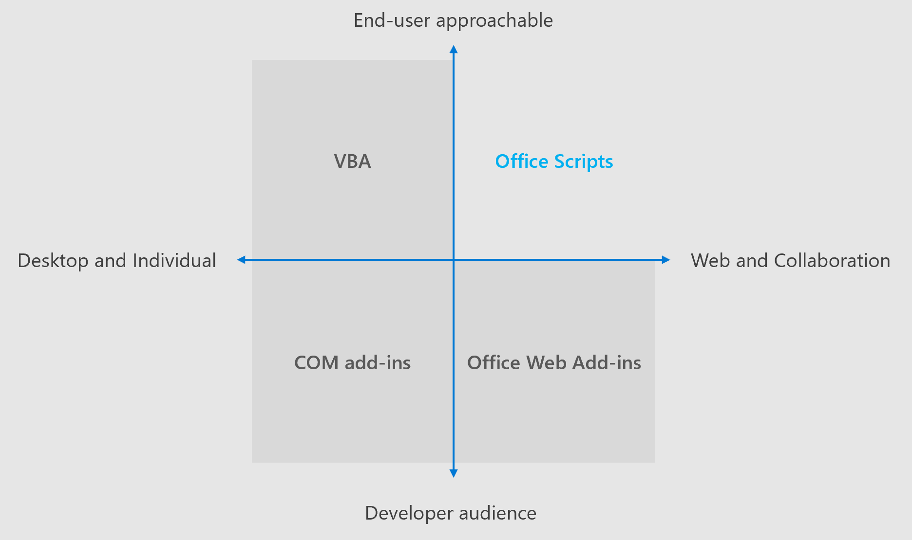

# Diferenças entre scripts do Office e suplementos do OfficeDifferences between Office Scripts and Office Add-ins

Os suplementos do Office e os scripts do Office têm muito em comum.Office Add-ins and Office Scripts have a lot in common. Ambas oferecem controle automatizado de uma pasta de trabalho do `Excel` Excel por meio do namespace da API JavaScript do Office.They both offer automated control of an Excel workbook through the `Excel` namespace of the Office JavaScript API. No entanto, os scripts do Office são mais limitados em seu escopo.However, Office Scripts are more limited in their scope.

Os scripts do Office são executados para conclusão com um botão manual ou como uma etapa da [automatização de energia](https://flow.microsoft.com/), enquanto os suplementos do Office são persistentes enquanto seus painéis de tarefas estão abertos.Office Scripts run to completion with a manual button press or as a step in [Power Automate](https://flow.microsoft.com/), whereas Office Add-ins persist while their task panes are open. Isso significa que os suplementos podem manter o estado durante uma sessão, enquanto os scripts do Office não mantêm um estado interno entre as execuções.This means the add-ins can maintain state during a session, whereas Office Scripts do not maintain an internal state between runs. Se você descobrir que sua extensão do Excel precisa exceder os recursos da plataforma de script, visite a [documentação de suplementos do Office](/office/dev/add-ins) para saber mais sobre os suplementos do Office.If you find that your Excel extension needs to exceed the scripting platform's capabilities, visit the [Office Add-ins documentation](/office/dev/add-ins) to learn more about Office Add-ins.

O restante deste artigo descreve as principais diferenças entre os suplementos do Office e os scripts do Office.The rest of this article describes on the main differences between Office Add-ins and Office Scripts.

## Suporte à plataformaPlatform Support

Os suplementos do Office são de plataforma cruzada.Office Add-ins are cross-platform. Eles funcionam nas plataformas de área de trabalho do Windows, Mac, iOS e Web e fornecem a mesma experiência em cada.They work across Windows desktop, Mac, iOS, and web platforms and provide the same experience on each. Qualquer exceção a isso é indicada na documentação da API individual.Any exception to this is noted in the documentation of the individual API.

Atualmente, os scripts do Office só têm suporte no Excel na Web.Office Scripts are currently only supported by for Excel on the web. Toda gravação, edição e execução é feita na plataforma da Web.All recording, editing, and running is done on the web platform.

## APIsAPIs

Os scripts do Office oferecem suporte à maioria das APIs JavaScript do Excel, o que significa que há muita sobreposição de funcionalidade entre as duas plataformas.Office Scripts support most of the Excel JavaScript APIs, which means there's  a lot of functionality overlap between the two platforms. Há duas exceções: eventos e APIs comuns.There are two exceptions: events and Common APIs.

### EventosEvents

Scripts do Office não dão suporte a [eventos](/office/dev/add-ins/excel/excel-add-ins-events).Office Scripts do not support [events](/office/dev/add-ins/excel/excel-add-ins-events). Cada script executa o código em um único `main` método e, em seguida, termina.Every script runs the code in a single `main` method, then ends. Ele não reativa quando os eventos são acionados e, portanto, não podem registrar eventos.It does not reactivate when events are triggered, and thus, cannot register events.

### APIs comunsCommon APIs

Scripts do Office não podem usar [APIs comuns](/javascript/api/office).Office Scripts cannot use [Common APIs](/javascript/api/office). Se você precisar de autenticação, de janelas de diálogo ou de outros recursos que são suportados apenas por APIs comuns, provavelmente precisará criar um suplemento do Office em vez de um script do Office.If you need authentication, dialog windows, or other features that are only supported by Common APIs, you'll likely need to create an Office Add-in instead of an Office Script.

## Confira tambémSee also

- [Scripts do Office no Excel na WebOffice Scripts in Excel on the web](../overview/excel.md)
- [Diferenças entre scripts do Office e macros VBADifferences between Office Scripts and VBA macros](vba-differences.md)
- [Solução de problemas dos scripts do OfficeTroubleshooting Office Scripts](../testing/troubleshooting.md)
- [Criar um suplemento do painel de tarefas do ExcelBuild an Excel task pane add-in](/office/dev/add-ins/quickstarts/excel-quickstart-jquery)
