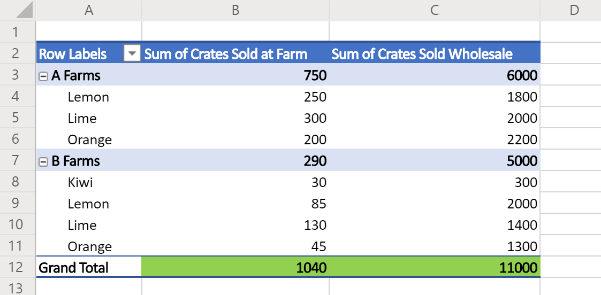

# <a name="sample-scripts-for-office-scripts-in-excel-on-the-web-preview"></a>Scripts de exemplo para scripts do Office no Excel na Web (visualização)

Os exemplos a seguir são scripts simples para você experimentar em suas próprias pastas de trabalho. Para usá-los no Excel na Web:

1. Abra a guia **Automação**.
2. Pressione **Editor de código**.
3. Pressione **novo script** no painel de tarefas do editor de código.
4. Substitua todo o script pelo exemplo de sua escolha.
5. Pressione **executar** no painel de tarefas do editor de código.

[!INCLUDE [Preview note](../includes/preview-note.md)]

## <a name="scripting-basics"></a>Noções básicas sobre scripts

Estes exemplos demonstram blocos de construção fundamentais para scripts do Office. Adicione-os aos seus scripts para estender sua solução e resolver problemas comuns.

### <a name="read-and-log-one-cell"></a>Ler e registrar uma célula

Este exemplo lê o valor de **a1** e o imprime no console.

```typescript
function main(workbook: ExcelScript.Workbook) {
  // Get the current worksheet.
  let selectedSheet = workbook.getActiveWorksheet();

  // Get the value of cell A1.
  let range = selectedSheet.getRange("A1");
  
  // Print the value of A1.
  console.log(range.getValue());
}
```

### <a name="read-the-active-cell"></a>Ler a célula ativa

Este script registra o valor da célula ativa atual. Se várias células estiverem selecionadas, a célula superior à extrema esquerda será registrada.

```typescript
function main(workbook: ExcelScript.Workbook) {
  // Get the current active cell in the workbook.
  let cell = workbook.getActiveCell();

  // Log that cell's value.
  console.log(`The current cell's value is ${cell.getValue()}`);
}
```

### <a name="change-an-adjacent-cell"></a>Alterar uma célula adjacente

Esse script Obtém células adjacentes usando referências relativas. Observe que, se a célula ativa estiver na linha superior, parte do script falhará, pois ela faz referência à célula acima da selecionada atualmente.

```typescript
function main(workbook: ExcelScript.Workbook) {
  // Get the currently active cell in the workbook.
  let activeCell = workbook.getActiveCell();
  console.log(`The active cell's address is: ${activeCell.getAddress()}`);

  // Get the cell to the right of the active cell and set its value and color.
  let rightCell = activeCell.getOffsetRange(0,1);
  rightCell.setValue("Right cell");
  console.log(`The right cell's address is: ${rightCell.getAddress()}`);
  rightCell.getFormat().getFont().setColor("Magenta");
  rightCell.getFormat().getFill().setColor("Cyan");

  // Get the cell to the above of the active cell and set its value and color.
  // Note that this operation will fail if the active cell is in the top row.
  let aboveCell = activeCell.getOffsetRange(-1, 0);
  aboveCell.setValue("Above cell");
  console.log(`The above cell's address is: ${aboveCell.getAddress()}`);
  aboveCell.getFormat().getFont().setColor("White");
  aboveCell.getFormat().getFill().setColor("Black");
}
```

### <a name="change-all-adjacent-cells"></a>Alterar todas as células adjacentes

Esse script copia a formatação na célula ativa para as células vizinhas. Observe que esse script só funciona quando a célula ativa não está em uma borda da planilha.

```typescript
function main(workbook: ExcelScript.Workbook) {
  // Get the active cell.
  let activeCell = workbook.getActiveCell();

  // Get the cell that's one row above and one column to the left of the active cell.
  let cornerCell = activeCell.getOffsetRange(-1,-1);

  // Get a range that includes all the cells surrounding the active cell.
  let surroundingRange = cornerCell.getResizedRange(2, 2)

  // Copy the formatting from the active cell to the new range.
  surroundingRange.copyFrom(
    activeCell, /* The source range. */
    ExcelScript.RangeCopyType.formats /* What to copy. */
    );
}
```

### <a name="work-with-dates"></a>Trabalhar com datas

Os exemplos nesta seção mostram como usar o objeto JavaScript [Date](https://developer.mozilla.org/docs/web/javascript/reference/global_objects/date) .

O exemplo a seguir obtém a data e hora atuais e, em seguida, grava esses valores em duas células da planilha ativa.

```TypeScript
function main(workbook: ExcelScript.Workbook) {
  // Get the cells at A1 and B1.
  let dateRange = workbook.getActiveWorksheet().getRange("A1");
  let timeRange = workbook.getActiveWorksheet().getRange("B1");

  // Get the current date and time with the JavaScript Date object.
  let date = new Date(Date.now());

  // Add the date string to A1.
  dateRange.setValue(date.toLocaleDateString());

  // Add the time string to B1.
  timeRange.setValue(date.toLocaleTimeString());
}
```

A próxima amostra lê uma data que é armazenada no Excel e a converte para um objeto de data JavaScript. Ele usa o [número de série numérico da data](https://support.office.com/article/now-function-3337fd29-145a-4347-b2e6-20c904739c46) como entrada para a data JavaScript.

```TypeScript
function main(workbook: ExcelScript.Workbook) {
  // Read a date at cell A1 from Excel.
  let dateRange = workbook.getActiveWorksheet().getRange("A1");

  // Convert the Excel date to a JavaScript Date object.
  let excelDateValue = dateRange.getValue();
  let javaScriptDate = new Date(Math.round((excelDateValue - 25569) * 86400 * 1000));
  console.log(javaScriptDate);
}
```

## <a name="display-data"></a>Exibir dados

Estes exemplos demonstram como trabalhar com dados de planilha e fornecer aos usuários uma melhor visualização ou organização.

### <a name="apply-conditional-formatting"></a>Aplicar formatação condicional

Este exemplo aplica formatação condicional ao intervalo atualmente usado na planilha. A formatação condicional é um preenchimento verde para os primeiros 10% dos valores.

```TypeScript
function main(workbook: ExcelScript.Workbook) {
  // Get the current worksheet.
  let selectedSheet = workbook.getActiveWorksheet();

  // Get the used range in the worksheet.
  let range = selectedSheet.getUsedRange();

  // Set the fill color to green for the top 10% of values in the range.
  let conditionalFormat = range.addConditionalFormat(ExcelScript.ConditionalFormatType.topBottom)
  conditionalFormat.getTopBottom().getFormat().getFill().setColor("green");
  conditionalFormat.getTopBottom().setRule({
    rank: 10, // The percentage threshold.
    type: ExcelScript.ConditionalTopBottomCriterionType.topPercent // The type of the top/bottom condition.
  });
}
```

### <a name="create-a-sorted-table"></a>Criar uma tabela classificada

Este exemplo cria uma tabela a partir do intervalo usado da planilha atual e a classifica com base na primeira coluna.

```TypeScript
function main(workbook: ExcelScript.Workbook) {
  // Get the current worksheet.
  let selectedSheet = workbook.getActiveWorksheet();

  // Create a table with the used cells.
  let usedRange = selectedSheet.getUsedRange();
  let newTable = selectedSheet.addTable(usedRange, true);

  // Sort the table using the first column.
  newTable.getSort().apply([{ key: 0, ascending: true }]);
}
```

### <a name="log-the-grand-total-values-from-a-pivottable"></a>Registrar os valores de "total geral" de uma tabela dinâmica

Este exemplo localiza a primeira tabela dinâmica na pasta de trabalho e registra os valores nas células "total geral" (conforme realçado em verde na imagem abaixo).



```TypeScript
function main(workbook: ExcelScript.Workbook) {
  // Get the first PivotTable in the workbook.
  let pivotTable = workbook.getPivotTables()[0];

  // Get the names of each data column in the PivotTable.
  let pivotColumnLabelRange = pivotTable.getLayout().getColumnLabelRange();

  // Get the range displaying the pivoted data.
  let pivotDataRange = pivotTable.getLayout().getRangeBetweenHeaderAndTotal();

  // Get the range with the "grand totals" for the PivotTable columns.
  let grandTotalRange = pivotDataRange.getLastRow();

  // Print each of the "Grand Totals" to the console.
  grandTotalRange.getValues()[0].forEach((column, columnIndex) => {
    console.log(`Grand total of ${pivotColumnLabelRange.getValues()[0][columnIndex]}: ${grandTotalRange.getValues()[0][columnIndex]}`);
    // Example log: "Grand total of Sum of Crates Sold Wholesale: 11000"
  });
}
```

## <a name="scenario-samples"></a>Exemplos de cenário

Para obter exemplos de soluções maiores e reais, visite [exemplos de cenários de scripts do Office](scenarios/sample-scenario-overview.md).

## <a name="suggest-new-samples"></a>Sugerir novos exemplos

Boas-vindas de sugestões para novos exemplos. Se houver um cenário comum que ajudaria outros desenvolvedores de scripts, diga-nos na seção de comentários abaixo.
