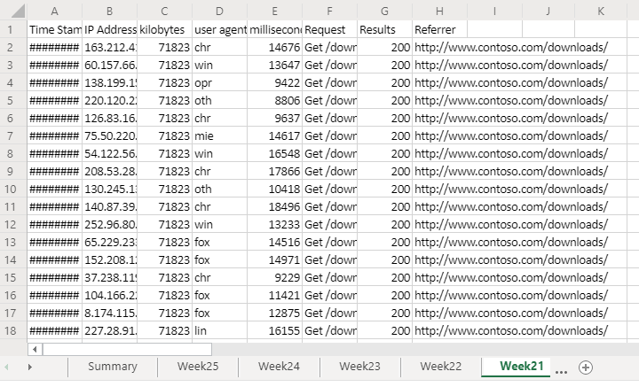
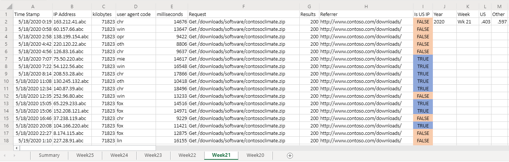
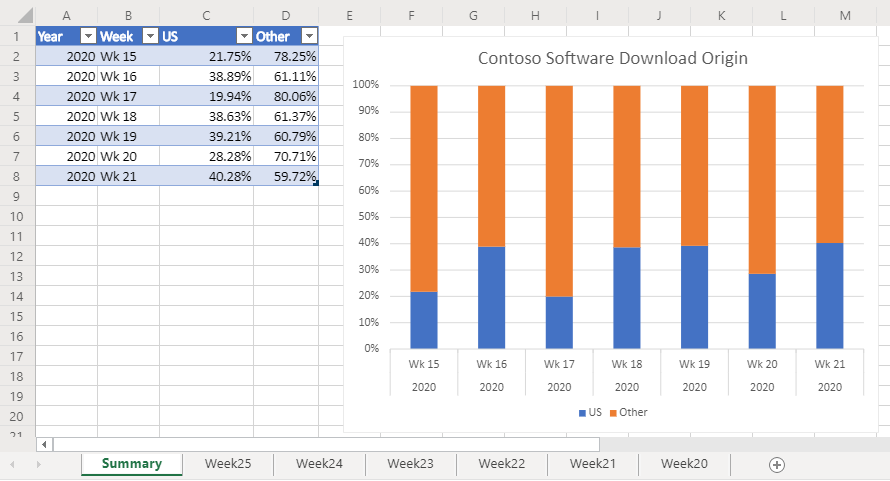

# <a name="office-scripts-sample-scenario-analyze-web-downloads"></a>Cenário de exemplo de scripts do Office: analisar downloads da Web

Neste cenário, você está com a tarefa de analisar relatórios de download no site da sua empresa. O objetivo dessa análise é determinar se o tráfego da Web está vindo dos Estados Unidos ou em qualquer lugar do mundo.

Seus colegas carregam os dados brutos na sua pasta de trabalho. O conjunto de dados de cada semana tem sua própria planilha. Há também a planilha de **Resumo** com uma tabela e um gráfico que mostra as tendências da semana sobre a semana.

Você desenvolverá um script que analisa dados de downloads semanais na planilha ativa. Ele analisará o endereço IP associado a cada download e determinará se ele veio ou não dos EUA. A resposta será inserida na planilha como um valor booliano ("TRUE" ou "FALSE") e a formatação condicional será aplicada a essas células. Os resultados do local do endereço IP serão totalizados na planilha e copiados para a tabela Resumo.

## <a name="scripting-skills-covered"></a>Habilidades de script abordadas

- Análise de texto
- Subfunções em scripts
- Formatação condicional
- Tabelas

## <a name="demo-video"></a>Vídeo de demonstração

Este exemplo foi demonstrado como parte da chamada da comunidade de desenvolvedores dos suplementos do Office para fevereiro de 2020.

> [!VIDEO https://www.youtube.com/embed/vPEqbb7t6-Y?start=154]

> [!NOTE]
> O código mostrado neste vídeo usa um modelo de API mais antigo (as [APIs assíncronas scripts do Office](../../develop/excel-async-model.md)). O exemplo apresentado nesta página foi atualizado, mas o código parece um pouco diferente da gravação. As alterações não afetam o comportamento do script ou o outro conteúdo na demonstração do apresentador.

## <a name="setup-instructions"></a>Instruções de configuração

1. Baixe <a href="analyze-web-downloads.xlsx">analyze-web-downloads.xlsx</a> para o onedrive.

2. Abra a pasta de trabalho com o Excel para a Web.

3. Na guia **automatizar** , abra o **Editor de código**.

4. No painel de tarefas **Editor de código** , pressione **novo script** e cole o script a seguir no editor.

    ```TypeScript
    function main(workbook: ExcelScript.Workbook) {
      // Get the Summary worksheet and table.
      let summaryWorksheet = workbook.getWorksheet("Summary");
      let summaryTable = summaryWorksheet?.getTable("Table1");
      if (!summaryWorksheet || !summaryTable) {
          console.log("The script expects the Summary worksheet with a summary table named Table1. Please download the correct template and try again.");
          return;
      }
  
      // Get the current worksheet.
      let currentWorksheet = workbook.getActiveWorksheet();
      if (!currentWorksheet.getName().toLocaleLowerCase().startsWith("week")) {
          console.log("Please switch worksheet to one of the weekly data sheets and try again.")
          return;
      }
  
      // Get the values of the active range of the active worksheet.
      let logRange = currentWorksheet.getUsedRange();
  
        if (logRange.getColumnCount() !== 8) {
        console.log(`Verify that you are on the correct worksheet. Either the week's data has been already processed or the content is incorrect. The following columns are expected: ${[
          "Time Stamp", "IP Address", "kilobytes", "user agent code", "milliseconds", "Request", "Results", "Referrer"
        ]}`);
        return;
      }
      // Get the range that will contain TRUE/FALSE if the IP address is from the United States (US).
      let isUSColumn = logRange
          .getLastColumn()
          .getOffsetRange(0, 1);
  
      // Get the values of all the US IP addresses.
      let ipRange = workbook.getWorksheet("USIPAddresses").getUsedRange();
      let ipRangeValues = ipRange.getValues();
      let logRangeValues = logRange.getValues();
      // Remove the first row.
      let topRow = logRangeValues.shift();
      console.log(`Analyzing ${logRangeValues.length} entries.`);
  
      // Create a new array to contain the boolean representing if this is a US IP address.
      let newCol = [];
  
      // Go through each row in worksheet and add Boolean.
      for (let i = 0; i < logRangeValues.length; i++) {
          let curRowIP = logRangeValues[i][1];
          if (findIP(ipRangeValues, ipAddressToInteger(curRowIP)) > 0) {
              newCol.push([true]);
          } else {
              newCol.push([false]);
          }
      }
  
      // Remove the empty column header and add proper heading.
      newCol = [["Is US IP"], ...newCol];
  
      // Write the result to the spreadsheet.
      console.log(`Adding column to indicate whether IP belongs to US region or not at address: ${isUSColumn.getAddress()}`);
      console.log(newCol.length);
      console.log(newCol);
      isUSColumn.setValues(newCol);
  
      // Call the local function to add summary data to the worksheet.
      addSummaryData();
  
      // Call the local function to apply conditional formatting.
  
      applyConditionalFormatting(isUSColumn);
  
      // Autofit columns.
      currentWorksheet.getUsedRange().getFormat().autofitColumns();
  
      // Get the calculated summary data.
      let summaryRangeValues = currentWorksheet.getRange("J2:M2").getValues();
  
      // Add the corresponding row to the summary table.
      summaryTable.addRow(null, summaryRangeValues[0]);
      console.log("Complete.");
      return;

    /**
     * A function to add summary data on the worksheet.
     */
    function addSummaryData() {
        // Add a summary row and table.
        let summaryHeader = [["Year", "Week", "US", "Other"]];
        let countTrueFormula =
            "=COUNTIF(" + isUSColumn.getAddress() + ', "=TRUE")/' + (newCol.length - 1);
        let countFalseFormula =
            "=COUNTIF(" + isUSColumn.getAddress() + ', "=FALSE")/' + (newCol.length - 1);

        let summaryContent = [
            [
                '=TEXT(A2,"YYYY")',
                '=TEXTJOIN(" ", FALSE, "Wk", WEEKNUM(A2))',
                countTrueFormula,
                countFalseFormula
            ]
        ];
        let summaryHeaderRow = currentWorksheet
            .getRange("J1:M1");
        let summaryContentRow = currentWorksheet
            .getRange("J2:M2");
        console.log("2");

        summaryHeaderRow.setValues(summaryHeader);
        console.log("3");

        summaryContentRow.setValues(summaryContent);
        console.log("4");

        let formats = [[".000", ".000"]];
        summaryContentRow
            .getOffsetRange(0, 2)
            .getResizedRange(0, -2).setNumberFormats(formats);
        }
    }
    /**
     * Apply conditional formatting based on TRUE/FALSE values of the Is US IP column.
     */
    function applyConditionalFormatting(isUSColumn: ExcelScript.Range) {
        // Add conditional formatting to the new column.
        let conditionalFormatTrue = isUSColumn.addConditionalFormat(
            ExcelScript.ConditionalFormatType.cellValue
        );
        let conditionalFormatFalse = isUSColumn.addConditionalFormat(
            ExcelScript.ConditionalFormatType.cellValue
        );
        // Set TRUE to light blue and FALSE to light orange.
        conditionalFormatTrue.getCellValue().getFormat().getFill().setColor("#8FA8DB");
        conditionalFormatTrue.getCellValue().setRule({
            formula1: "=TRUE",
            operator: ExcelScript.ConditionalCellValueOperator.equalTo
        });
        conditionalFormatTrue.getCellValue().getFormat().getFill().setColor("#F8CCAD");
        conditionalFormatTrue.getCellValue().setRule({
            formula1: "=FALSE",
            operator: ExcelScript.ConditionalCellValueOperator.equalTo
        });
    }
    /**
     * Translate an IP address into an integer.
     * @param ipAddress: IP address to verify.
     */
    function ipAddressToInteger(ipAddress: string): number {
        // Split the IP address into octets.
        let octets = ipAddress.split(".");

        // Create a number for each octet and do the math to create the integer value of the IP address.
        let fullNum =
            // Define an arbitrary number for the last octet.
            111 +
            parseInt(octets[2]) * 256 +
            parseInt(octets[1]) * 65536 +
            parseInt(octets[0]) * 16777216;
        return fullNum;
    }
    /**
     * Return the row number where the ip address is found.
     * @param ipLookupTable IP look-up table.
     * @param n IP address to number value.  
     */
    function findIP(ipLookupTable: number[][], n: number): number {
        for (let i = 0; i < ipLookupTable.length; i++) {
            if (ipLookupTable[i][0] <= n && ipLookupTable[i][1] >= n) {
                return i;
            }
        }
        return -1;
    }
    ```

5. Renomeie o script para **analisar downloads da Web** e salvá-lo.

## <a name="running-the-script"></a>Executando o script

Navegue até qualquer uma das planilhas **semana \* \* ** e execute o script de **análise de downloads da Web** . O script aplicará a formatação condicional e o rótulo de local na planilha atual. Ele também atualizará a planilha de **Resumo** .

### <a name="before-running-the-script"></a>Antes de executar o script



### <a name="after-running-the-script"></a>Após executar o script




