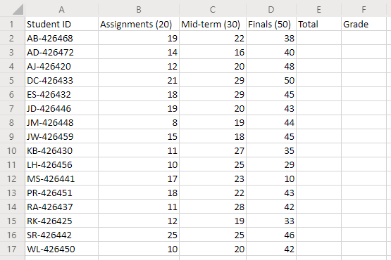
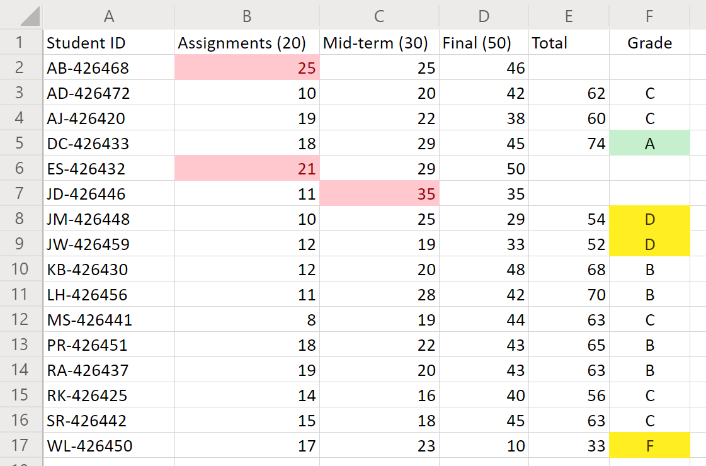

# <a name="office-scripts-sample-scenario-grade-calculator"></a><span data-ttu-id="ada26-103">Cenário de exemplo de scripts do Office: calculadora de série</span><span class="sxs-lookup"><span data-stu-id="ada26-103">Office Scripts sample scenario: Grade calculator</span></span>

<span data-ttu-id="ada26-104">Neste cenário, você é um instrutor tallyingndo notas finais de todos os alunos.</span><span class="sxs-lookup"><span data-stu-id="ada26-104">In this scenario, you're an instructor tallying every student's end-of-term grades.</span></span> <span data-ttu-id="ada26-105">Você está inserindo as pontuações para suas atribuições e testes enquanto vai.</span><span class="sxs-lookup"><span data-stu-id="ada26-105">You've been entering the scores for their assignments and tests as you go.</span></span> <span data-ttu-id="ada26-106">Agora, é hora de determinar os Fates dos alunos.</span><span class="sxs-lookup"><span data-stu-id="ada26-106">Now, it is time to determine the students' fates.</span></span>

<span data-ttu-id="ada26-107">Você desenvolverá um script que totaliza as notas para cada categoria de ponto.</span><span class="sxs-lookup"><span data-stu-id="ada26-107">You'll develop a script that totals the grades for each point category.</span></span> <span data-ttu-id="ada26-108">Em seguida, ele atribuirá uma nota de carta a cada aluno com base no total.</span><span class="sxs-lookup"><span data-stu-id="ada26-108">It will then assign a letter grade to each student based on the total.</span></span> <span data-ttu-id="ada26-109">Para ajudar a garantir a precisão, você adicionará algumas verificações para ver se alguma Pontuação individual é muito baixa ou alta.</span><span class="sxs-lookup"><span data-stu-id="ada26-109">To help ensure accuracy, you'll add a couple checks to see if any individual scores are too low or high.</span></span> <span data-ttu-id="ada26-110">Se a pontuação de um aluno for menor do que zero ou maior do que o valor de ponto possível, o script sinalizará a célula com um preenchimento vermelho e não fará o total dos pontos do aluno.</span><span class="sxs-lookup"><span data-stu-id="ada26-110">If a student's score is less than zero or more than the possible point value, the script will flag the cell with a red fill and not total that student's points.</span></span> <span data-ttu-id="ada26-111">Essa será uma indicação clara de quais registros você precisa fazer uma verificação dupla.</span><span class="sxs-lookup"><span data-stu-id="ada26-111">This will be a clear indication of which records you need to double-check.</span></span> <span data-ttu-id="ada26-112">Você também adicionará alguma formatação básica às notas para que possa exibir rapidamente a parte superior e a parte inferior da classe.</span><span class="sxs-lookup"><span data-stu-id="ada26-112">You'll also add some basic formatting to the grades so you can quickly view the top and bottom of the class.</span></span>

## <a name="scripting-skills-covered"></a><span data-ttu-id="ada26-113">Habilidades de script abordadas</span><span class="sxs-lookup"><span data-stu-id="ada26-113">Scripting skills covered</span></span>

- <span data-ttu-id="ada26-114">Formatação de célula</span><span class="sxs-lookup"><span data-stu-id="ada26-114">Cell formatting</span></span>
- <span data-ttu-id="ada26-115">Verificação de erros</span><span class="sxs-lookup"><span data-stu-id="ada26-115">Error checking</span></span>
- <span data-ttu-id="ada26-116">Expressões regulares</span><span class="sxs-lookup"><span data-stu-id="ada26-116">Regular expressions</span></span>
- <span data-ttu-id="ada26-117">Formatação condicional</span><span class="sxs-lookup"><span data-stu-id="ada26-117">Conditional formatting</span></span>

## <a name="setup-instructions"></a><span data-ttu-id="ada26-118">Instruções de configuração</span><span class="sxs-lookup"><span data-stu-id="ada26-118">Setup instructions</span></span>

1. <span data-ttu-id="ada26-119">Baixe <a href="grade-calculator.xlsx">grade-calculator.xlsx</a> para o onedrive.</span><span class="sxs-lookup"><span data-stu-id="ada26-119">Download <a href="grade-calculator.xlsx">grade-calculator.xlsx</a> to your OneDrive.</span></span>

2. <span data-ttu-id="ada26-120">Abra a pasta de trabalho com o Excel para a Web.</span><span class="sxs-lookup"><span data-stu-id="ada26-120">Open the workbook with Excel for the web.</span></span>

3. <span data-ttu-id="ada26-121">Na guia **automatizar** , abra o **Editor de código**.</span><span class="sxs-lookup"><span data-stu-id="ada26-121">Under the **Automate** tab, open the **Code Editor**.</span></span>

4. <span data-ttu-id="ada26-122">No painel de tarefas **Editor de código** , pressione **novo script** e cole o script a seguir no editor.</span><span class="sxs-lookup"><span data-stu-id="ada26-122">In the **Code Editor** task pane, press **New Script** and paste the following script into the editor.</span></span>

    ```TypeScript
    function main(workbook: ExcelScript.Workbook) {
      // Get the worksheet and validate the data.
      let studentsRange = workbook.getActiveWorksheet().getUsedRange();
      if (studentsRange.getColumnCount() !== 6) {
        throw new Error(`The required columns are not present. Expected column headers: "Student ID | Assignment score | Mid-term | Final | Total | Grade"`);
      }

      let studentData = studentsRange.getValues();

      // Clear the total and grade columns.
      studentsRange.getColumn(4).getCell(1, 0).getAbsoluteResizedRange(studentData.length - 1, 2).clear();

      // Clear all conditional formatting.
      workbook.getActiveWorksheet().getUsedRange().clearAllConditionalFormats();

      // Use regular expressions to read the max score from the assignment, mid-term, and final scores columns.
      let maxScores: string[] = [];
      const assignmentMaxMatches = studentData[0][1].match(/\d+/);
      const midtermMaxMatches = studentData[0][2].match(/\d+/);
      const finalMaxMatches = studentData[0][3].match(/\d+/);

      // Check the matches happened before proceeding.
      if (!(assignmentMaxMatches && midtermMaxMatches && finalMaxMatches)) {
        throw new Error(`The scores are not present in the column headers. Expected format: "Assignments (n)|Mid-term (n)|Final (n)"`);
      }

      // Use the first (and only) match from the regular expressions as the max scores.
      maxScores = [assignmentMaxMatches[0], midtermMaxMatches[0], finalMaxMatches[0]];

      // Set conditional formatting for each of the assignment, mid-term, and final scores columns.
      maxScores.forEach((score, i) => {
        let range = studentsRange.getColumn(i + 1).getCell(0, 0).getRowsBelow(studentData.length - 1);
        setCellValueConditionalFormatting(
          score,
          range,
          "#9C0006",
          "#FFC7CE",
          ExcelScript.ConditionalCellValueOperator.greaterThan
        )
      });

      // Store the current range information to avoid calling the workbook in the loop.
      let studentsRangeFormulas = studentsRange.getColumn(4).getFormulasR1C1();
      let studentsRangeValues = studentsRange.getColumn(5).getValues();

      /* Iterate over each of the student rows and compute the total score and letter grade.
      * Note that iterator starts at index 1 to skip first (header) row.
      */
      for (let i = 1; i < studentData.length; i++) {
        // If any of the scores are invalid, skip processing it.
        if (studentData[i][1] > maxScores[0] ||
          studentData[i][2] > maxScores[1] ||
          studentData[i][3] > maxScores[2]) {
          continue;
        }
        const total = studentData[i][1] + studentData[i][2] + studentData[i][3];
        let grade: string;
        switch (true) {
          case total < 60:
            grade = "F";
            break;
          case total < 70:
            grade = "D";
            break;
          case total < 80:
            grade = "C";
            break;
          case total < 90:
            grade = "B";
            break;
          default:
            grade = "A";
            break;
        }

        // Set total score formula.
        studentsRangeFormulas[i][0] = '=RC[-2]+RC[-1]';
        // Set grade cell.
        studentsRangeValues[i][0] = grade;
      }

      // Set the formulas and values outside the loop.
      studentsRange.getColumn(4).setFormulasR1C1(studentsRangeFormulas);
      studentsRange.getColumn(5).setValues(studentsRangeValues);

      // Put a conditional formatting on the grade column.
      let totalRange = studentsRange.getColumn(5).getCell(0, 0).getRowsBelow(studentData.length - 1);
      setCellValueConditionalFormatting(
        "A",
        totalRange,
        "#001600",
        "#C6EFCE",
        ExcelScript.ConditionalCellValueOperator.equalTo
      );
      ["D", "F"].forEach((grade) => {
        setCellValueConditionalFormatting(
          grade,
          totalRange,
          "#443300",
          "#FFEE22",
          ExcelScript.ConditionalCellValueOperator.equalTo
        );
      })
      // Center the grade column.
      studentsRange.getColumn(5).getFormat().setHorizontalAlignment(ExcelScript.HorizontalAlignment.center);
    }

    /**
     * Helper function to apply conditional formatting.
     * @param value Cell value to use in conditional formatting formula1.
     * @param range Target range.
     * @param fontColor Font color to use.
     * @param fillColor Fill color to use.
     * @param operator Operator to use in conditional formatting.
     */
    function setCellValueConditionalFormatting(
      value: string,
      range: ExcelScript.Range,
      fontColor: string,
      fillColor: string,
      operator: ExcelScript.ConditionalCellValueOperator) {
      // Determine the formula1 based on the type of value parameter.
      let formula1: string;
      if (isNaN(Number(value))) {
        // For cell value equalTo rule, use this format: formula1: "=\"A\"",
        formula1 = `=\"${value}\"`;
      } else {
        // For number input (greater-than or less-than rules), just append '='.
        formula1 = `=${value}`;
      }

      // Apply conditional formatting.
      let conditionalFormatting : ExcelScript.ConditionalFormat;
      conditionalFormatting = range.addConditionalFormat(ExcelScript.ConditionalFormatType.cellValue);
      conditionalFormatting.getCellValue().getFormat().getFont().setColor(fontColor);
      conditionalFormatting.getCellValue().getFormat().getFill().setColor(fillColor);
      conditionalFormatting.getCellValue().setRule({formula1, operator});
    }
    ```

5. <span data-ttu-id="ada26-123">Renomeie o script para fazer a **grade** e salve-o.</span><span class="sxs-lookup"><span data-stu-id="ada26-123">Rename the script to **Grade Calculator** and save it.</span></span>

## <a name="running-the-script"></a><span data-ttu-id="ada26-124">Executando o script</span><span class="sxs-lookup"><span data-stu-id="ada26-124">Running the script</span></span>

<span data-ttu-id="ada26-125">Execute o script de **calculadora de nota** na planilha única.</span><span class="sxs-lookup"><span data-stu-id="ada26-125">Run the **Grade Calculator** script on the only worksheet.</span></span> <span data-ttu-id="ada26-126">O script totaliza as notas e atribui a cada aluno uma letra de nota.</span><span class="sxs-lookup"><span data-stu-id="ada26-126">The script will total the grades and assign each student a letter grade.</span></span> <span data-ttu-id="ada26-127">Se qualquer nota individual tiver mais pontos do que a atribuição ou o teste for importante, a classificação transgressor será marcada como vermelho e o total não será calculado.</span><span class="sxs-lookup"><span data-stu-id="ada26-127">If any individual grades have more points than the assignment or test is worth, then the offending grade is marked red and the total is not calculated.</span></span> <span data-ttu-id="ada26-128">Além disso, todas as notas ' A ' são realçadas em verde, enquanto as notas ' e ' F ' são realçadas em amarelo.</span><span class="sxs-lookup"><span data-stu-id="ada26-128">Also, any 'A' grades are highlighted in green, while 'D' and 'F' grades are highlighted in yellow.</span></span>

### <a name="before-running-the-script"></a><span data-ttu-id="ada26-129">Antes de executar o script</span><span class="sxs-lookup"><span data-stu-id="ada26-129">Before running the script</span></span>



### <a name="after-running-the-script"></a><span data-ttu-id="ada26-131">Após executar o script</span><span class="sxs-lookup"><span data-stu-id="ada26-131">After running the script</span></span>


