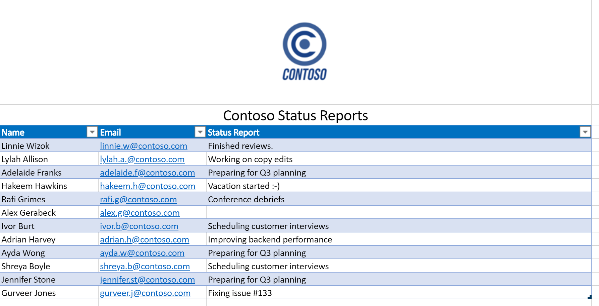
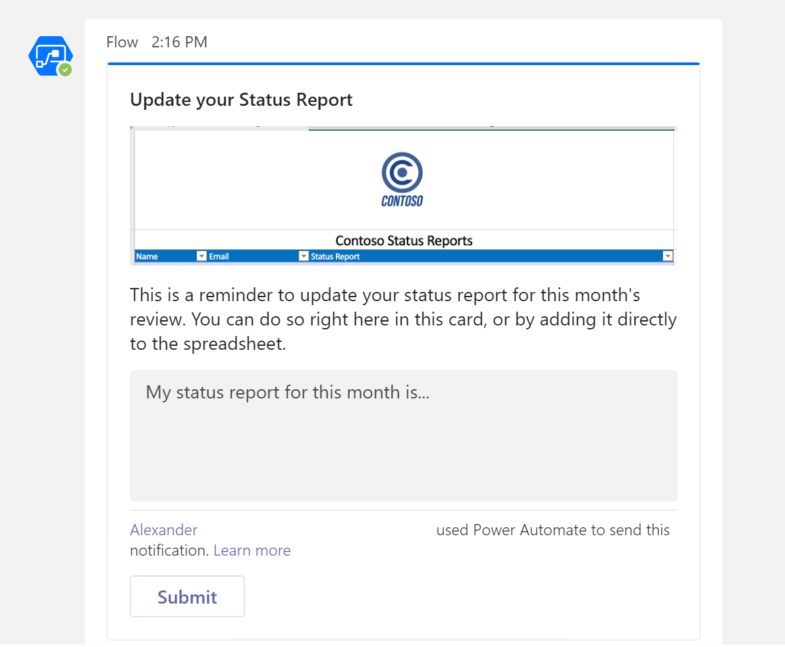
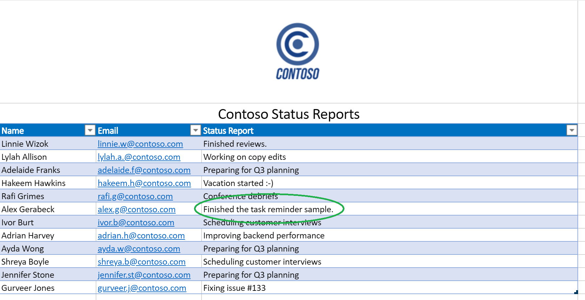

# <a name="office-scripts-sample-scenario-automated-task-reminders"></a>Cenário de exemplo de scripts do Office: lembretes de tarefas automatizadas

Neste cenário, você está gerenciando um projeto. Você usa uma planilha do Excel para acompanhar o status de seus funcionários todos os meses. Você geralmente precisa lembrar as pessoas para preencher seu status, portanto, você optou por automatizar esse processo de lembrete.

Você criará um fluxo automatizado de energia para mensagens com campos de status ausentes e aplicará as respostas à planilha. Para fazer isso, você desenvolverá um par de scripts para lidar com a pasta de trabalho. O primeiro script Obtém uma lista de pessoas com status em branco e o segundo script adiciona uma cadeia de caracteres de status à linha à direita. Você também fará uso de [cartões adaptáveis do teams](/microsoftteams/platform/task-modules-and-cards/what-are-cards) para que os funcionários insiram o status diretamente da notificação.

## <a name="scripting-skills-covered"></a>Habilidades de script abordadas

- Criar fluxos em automatização de energia
- Transmitir dados para scripts
- Retornar dados de scripts
- Cartões adaptáveis do teams
- Tabelas

## <a name="prerequisites"></a>Pré-requisitos

Este cenário usa [automatização de energia](https://flow.microsoft.com) e [o Microsoft Teams](https://www.microsoft.com/microsoft-365/microsoft-teams/group-chat-software). Você precisará associar-se à conta que você usa para desenvolver scripts do Office. Para obter acesso gratuito a uma assinatura de desenvolvedor da Microsoft para saber mais sobre o e trabalhar com esses aplicativos, considere participar do [programa de desenvolvedor do Microsoft 365](https://developer.microsoft.com/microsoft-365/dev-program).

## <a name="setup-instructions"></a>Instruções de configuração

1. Baixe <a href="task-reminders.xlsx">task-reminders.xlsx</a> para o onedrive.

2. Abra a pasta de trabalho no Excel na Web.

3. Na guia **automatizar** , abra o **Editor de código**.

4. Primeiro, precisamos de um script para obter todos os funcionários com relatórios de status ausentes da planilha. No painel de tarefas **Editor de código** , pressione **novo script** e cole o script a seguir no editor.

    ```typescript
    /**
     * This script looks for missing status reports in a project management table.
     *
     * @returns An array of Employee objects (containing their names and emails).
     */
    function main(workbook: ExcelScript.Workbook): Employee[] {
      // Get the first worksheet and the first table on that worksheet.
      let sheet = workbook.getFirstWorksheet()
      let table = sheet.getTables()[0];

      // Give the column indices names matching their expected content.
      const NAME_INDEX = 0;
      const EMAIL_INDEX = 1;
      const STATUS_REPORT_INDEX = 2;

      // Get the data for the whole table.
      let bodyRangeValues = table.getRangeBetweenHeaderAndTotal().getValues();

      // Create the array of Employee objects to return.
      let people: Employee[] = [];

      // Loop through the table and check each row for completion.
      for (let i = 0; i < bodyRangeValues.length; i++) {
        let row = bodyRangeValues[i];
        if (row[STATUS_REPORT_INDEX] === "") {
          // Save the email to return.
          people.push({ name: row[NAME_INDEX], email: row[EMAIL_INDEX] });
        }
      }

      // Log the array to verify we're getting the right rows.
      console.log(people);

      // Return the array of Employees.
      return people;
    }

    /**
     * An interface representing an employee.
     * An array of Employees will be returned from the script
     * for the Power Automate flow.
     */
    interface Employee {
      name: string;
      email: string;
    }
    ```

5. Salve o script com o nome **obter pessoas**.

6. Em seguida, precisamos de um segundo script para processar os cartões de relatório de status e colocar as novas informações na planilha. No painel de tarefas **Editor de código** , pressione **novo script** e cole o script a seguir no editor.

    ```typescript
    /**
     * This script applies the results of a Teams Adaptive Card about
     * a status update to a project management table.
     *
     * @param senderEmail - The email address of the employee updating their status.
     * @param statusReportResponse - The employee's status report.
     */
    function main(workbook: ExcelScript.Workbook,
      senderEmail: string,
      statusReportResponse: string) {

      // Get the first worksheet and the first table in that worksheet.
      let sheet = workbook.getFirstWorksheet();
      let table = sheet.getTables()[0];

      // Give the column indices names matching their expected content.
      const NAME_INDEX = 0;
      const EMAIL_INDEX = 1;
      const STATUS_REPORT_INDEX = 2;

      // Get the range and data for the whole table.
      let bodyRange = table.getRangeBetweenHeaderAndTotal();
      let tableRowCount = bodyRange.getRowCount();
      let bodyRangeValues = bodyRange.getValues();

      // Create a flag to denote success.
      let statusAdded = false;

      // Loop through the table and check each row for a matching email address.
      for (let i = 0; i < tableRowCount && !statusAdded; i++) {
        let row = bodyRangeValues[i];

        // Check if the row's email address matches.
        if (row[EMAIL_INDEX] === senderEmail) {
          // Add the Teams Adaptive Card response to the table.
          bodyRange.getCell(i, STATUS_REPORT_INDEX).setValues([
            [statusReportResponse]
          ]);
          statusAdded = true;
        }
      }

      // If successful, log the status update.
      if (statusAdded) {
        console.log(
          `Successfully added status report for ${senderEmail} containing: ${statusReportResponse}`
        );
      }
    }
    ```

7. Salve o script com o nome **salvar status**.

8. Agora, precisamos criar o fluxo. Abrir [automatização de energia](https://flow.microsoft.com/).

    > [!TIP]
    > Se você ainda não criou um fluxo antes, confira nosso tutorial [comece a usar scripts com a automatização de energia](../../tutorials/excel-power-automate-manual.md) para aprender as noções básicas.

9. Criar um novo **fluxo instantâneo**.

10. Escolha **acionar manualmente um fluxo** das opções e pressione **criar**.

11. O fluxo precisa chamar o script **obter pessoas** para obter todos os funcionários com campos de status vazios. Pressione **nova etapa** e selecione **Excel online (comercial)**. Em **ações**, selecione **Executar script (versão prévia)**. Forneça as seguintes entradas para a etapa de fluxo:

    - **Local**: onedrive for Business
    - **Biblioteca de documentos**: onedrive
    - **Arquivo**: task-reminders.xlsx
    - **Script**: obter pessoas

    

12. Em seguida, o fluxo precisa processar cada funcionário na matriz retornada pelo script. Pressione **nova etapa** e selecione **postar um cartão adaptável a um usuário do Teams e aguarde uma resposta**.

13. Para o campo **destinatário** , adicione **emails** do conteúdo dinâmico (a seleção terá o logotipo do Excel por ele). A adição de **email** faz com que a etapa de fluxo seja delimitada por um bloco **aplicar a cada** . Isso significa que a matriz será iterada pela automatização de energia.

14. O envio de um cartão adaptável exige que o JSON do cartão seja fornecido como a **mensagem**. Você pode usar o [Designer de cartão adaptável](https://adaptivecards.io/designer/) para criar cartões personalizados. Para este exemplo, use o JSON a seguir.  

    ```json
    {
      "$schema": "http://adaptivecards.io/schemas/adaptive-card.json",
      "type": "AdaptiveCard",
      "version": "1.0",
      "body": [
        {
          "type": "TextBlock",
          "size": "Medium",
          "weight": "Bolder",
          "text": "Update your Status Report"
        },
        {
          "type": "Image",
          "altText": "",
          "url": "https://i.imgur.com/f5RcuF3.png"
        },
        {
          "type": "TextBlock",
          "text": "This is a reminder to update your status report for this month's review. You can do so right here in this card, or by adding it directly to the spreadsheet.",
          "wrap": true
        },
        {
          "type": "Input.Text",
          "placeholder": "My status report for this month is...",
          "id": "response",
          "isMultiline": true
        }
      ],
      "actions": [
        {
          "type": "Action.Submit",
          "title": "Submit",
          "id": "submit"
        }
      ]
    }
    ```

15. Preencha os campos restantes da seguinte maneira:

    - **Mensagem de atualização**: Obrigado por enviar seu relatório de status. Sua resposta foi adicionada com êxito à planilha.
    - **Atualizar cartão**: Sim

16. No bloco **aplicar a cada** , seguindo o **cartão adaptável postar em um usuário do Teams e aguardar uma resposta**, pressione **Adicionar uma ação**. Selecione **Excel online (comercial)**. Em **ações**, selecione **Executar script (versão prévia)**. Forneça as seguintes entradas para a etapa de fluxo:

    - **Local**: onedrive for Business
    - **Biblioteca de documentos**: onedrive
    - **Arquivo**: task-reminders.xlsx
    - **Script**: salvar status
    - **senderEmail**: email *(conteúdo dinâmico do Excel)*
    - **statusReportResponse**: resposta *(conteúdo dinâmico do Teams)*

    

17. Salve o fluxo.

## <a name="running-the-flow"></a>Executando o fluxo

Para testar o fluxo, certifique-se de que todas as linhas de tabela com status em branco usem um endereço de email vinculado a uma conta de equipe (provavelmente, você deve usar seu próprio endereço de email durante o teste).

Você pode selecionar **testar** no editor de fluxo ou executar o fluxo na página **meus fluxos** . Depois de iniciar o fluxo e aceitar o uso das conexões necessárias, você receberá um cartão adaptável do Power Automated Teams. Depois que você preencher o campo status no cartão, o fluxo continuará e atualizará a planilha com o status que você fornecer.

### <a name="before-running-the-flow"></a>Antes de executar o fluxo



### <a name="receiving-the-adaptive-card"></a>Recebendo o cartão adaptável



### <a name="after-running-the-flow"></a>Após a execução do fluxo


