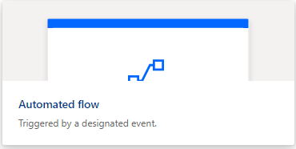
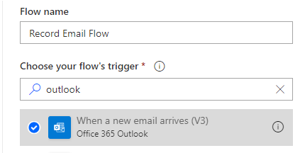
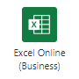
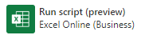
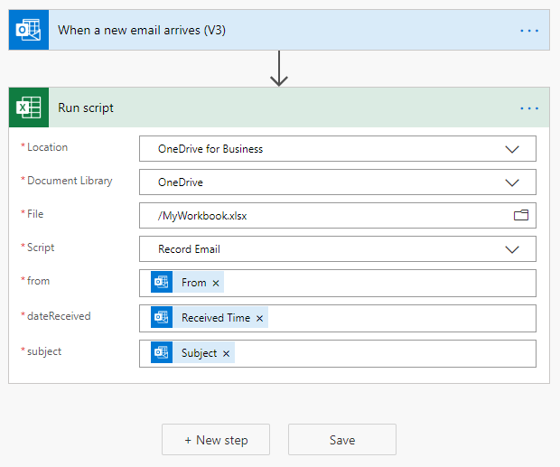
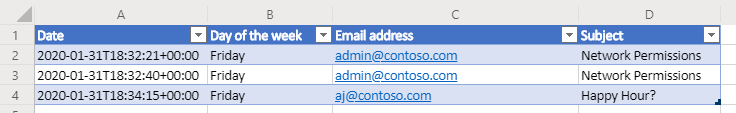
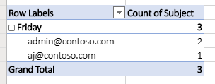

# <a name="automatically-run-scripts-with-automated-power-automate-flows-preview"></a>Executar scripts automaticamente com fluxos automáticos automatizados (visualização)

Este tutorial ensina como usar um script do Office para Excel na Web com [um fluxo de trabalho automatizado](https://flow.microsoft.com) automático. O script será executado automaticamente cada vez que você receber um email, gravando informações do email em uma pasta de trabalho do Excel.

## <a name="prerequisites"></a>Pré-requisitos

[!INCLUDE [Tutorial prerequisites](../includes/tutorial-prerequisites.md)]

> [!IMPORTANT]
> Este tutorial pressupõe que você tenha concluído os [scripts executar do Office no Excel na Web com o tutorial automatizar de energia](excel-power-automate-manual.md) .

## <a name="prepare-the-workbook"></a>Preparar a pasta de trabalho

A automatização de energia não pode usar [referências relativas](../develop/power-automate-integration.md#avoid-using-relative-references) como `Workbook.getActiveWorksheet` acessar componentes de pasta de trabalho. Portanto, precisamos de uma pasta de trabalho e planilha com nomes consistentes para que a automatização de energia seja referenciada.

1. Crie uma nova pasta de trabalho chamada **myworkbook**.

2. Vá para a guia **automatizar** e selecione **Editor de código**.

3. Selecione **novo script**.

4. Substitua o código existente pelo seguinte script e pressione **executar**. Isso instalará a pasta de trabalho com nomes consistentes de planilha, tabela e tabela dinâmica.

    ```TypeScript
    function main(workbook: ExcelScript.Workbook) {
      // Add a new worksheet to store our email table
      let emailsSheet = workbook.addWorksheet("Emails");

      // Add data and create a table
      emailsSheet.getRange("A1:D1").setValues([
        ["Date", "Day of the week", "Email address", "Subject"]
      ]);
      let newTable = workbook.addTable(emailsSheet.getRange("A1:D2"), true);
      newTable.setName("EmailTable");

      // Add a new PivotTable to a new worksheet
      let pivotWorksheet = workbook.addWorksheet("SubjectPivot");
      let newPivotTable = workbook.addPivotTable("Pivot", "EmailTable", pivotWorksheet.getRange("A3:C20"));

      // Setup the pivot hierarchies
      newPivotTable.addRowHierarchy(newPivotTable.getHierarchy("Day of the week"));
      newPivotTable.addRowHierarchy(newPivotTable.getHierarchy("Email address"));
      newPivotTable.addDataHierarchy(newPivotTable.getHierarchy("Subject"));
    }
    ```

## <a name="create-an-office-script-for-your-automated-workflow"></a>Criar um script do Office para o fluxo de trabalho automatizado

Vamos criar um script que registre informações de um email. Queremos saber como quais dias da semana recebemos a maioria dos emails e quantos remetentes exclusivos estão enviando esse email. Nossa pasta de trabalho tem uma tabela com **Data**, **dia da semana**, **endereço de email**e colunas de **assunto** . Nossa planilha também tem uma tabela dinâmica que está sendo dinamizada no **dia da semana** e **endereço de email** (essas são as hierarquias de linha). A contagem de **assuntos** exclusivos é as informações agregadas que estão sendo exibidas (a hierarquia de dados). Teremos o script atualizar essa tabela dinâmica depois de atualizar a tabela de email.

1. No editor de **códigos**, selecione **novo script**.

2. O fluxo que criaremos mais tarde no tutorial enviará as informações de script sobre cada email recebido. O script precisa aceitar essa entrada através de parâmetros na `main` função. Substitua o script padrão pelo seguinte script:

    ```TypeScript
    function main(
      workbook: ExcelScript.Workbook,
      from: string,
      dateReceived: string,
      subject: string) {

    }
    ```

3. O script precisa acessar a tabela e a tabela dinâmica da pasta de trabalho. Adicione o seguinte código ao corpo do script, após a abertura `{` :

    ```TypeScript
    // Get the email table.
    let emailWorksheet = workbook.getWorksheet("Emails");
    let table = emailWorksheet.getTable("EmailTable");
  
    // Get the PivotTable.
    let pivotTableWorksheet = workbook.getWorksheet("SubjectPivot");
    let pivotTable = pivotTableWorksheet.getPivotTable("Pivot");
    ```

4. O `dateReceived` parâmetro é do tipo `string` . Vamos convertê-lo em um [ `Date` objeto](../develop/javascript-objects.md#date) para que possamos obter facilmente o dia da semana. Depois disso, precisaremos mapear o valor do número do dia para uma versão mais legível. Adicione o código a seguir ao final do seu script, antes de fechar `}` :

    ```TypeScript
    // Parse the received date string.
    let date = new Date(dateReceived);

    // Convert number representing the day of the week into the name of the day.
    let dayText : string;
    switch (date.getDay()) {
      case 0:
        dayText = "Sunday";
        break;
      case 1:
        dayText = "Monday";
        break;
      case 2:
        dayText = "Tuesday";
        break;
      case 3:
        dayText = "Wednesday";
        break;
      case 4:
        dayText = "Thursday";
        break;
      case 5:
        dayText = "Friday";
        break;
      default:
        dayText = "Saturday";
        break;
    }
    ```

5. A `subject` cadeia de caracteres pode incluir a marca de resposta "Re:". Vamos remover isso da cadeia de caracteres para que os emails no mesmo thread tenham o mesmo assunto para a tabela. Adicione o código a seguir ao final do seu script, antes de fechar `}` :

    ```TypeScript
    // Remove the reply tag from the email subject to group emails on the same thread.
    let subjectText = subject.replace("Re: ", "");
    subjectText = subjectText.replace("RE: ", "");
    ```

6. Agora que os dados de email foram formatados para nossa preferência, vamos adicionar uma linha à tabela de email. Adicione o código a seguir ao final do seu script, antes de fechar `}` :

    ```TypeScript
    // Add the parsed text to the table.
    table.addRow(-1, [dateReceived, dayText, from, subjectText]);
    ```

7. Por fim, vamos garantir que a tabela dinâmica seja atualizada. Adicione o código a seguir ao final do seu script, antes de fechar `}` :

    ```TypeScript
    // Refresh the PivotTable to include the new row.
    pivotTable.refresh();
    ```

8. Renomeie seu **email de registro** de script e pressione **Salvar script**.

O script agora está pronto para um fluxo de trabalho automatizado de energia. Ele deve ser semelhante ao seguinte script:

```TypeScript
function main(
  workbook: ExcelScript.Workbook,
  from: string,
  dateReceived: string,
  subject: string) {
  // Get the email table.
  let emailWorksheet = workbook.getWorksheet("Emails");
  let table = emailWorksheet.getTable("EmailTable");

  // Get the PivotTable.
  let pivotTableWorksheet = workbook.getWorksheet("Pivot");
  let pivotTable = pivotTableWorksheet.getPivotTable("SubjectPivot");

  // Parse the received date string.
  let date = new Date(dateReceived);

  // Convert number representing the day of the week into the name of the day.
  let dayText: string;
  switch (date.getDay()) {
    case 0:
      dayText = "Sunday";
      break;
    case 1:
      dayText = "Monday";
      break;
    case 2:
      dayText = "Tuesday";
      break;
    case 3:
      dayText = "Wednesday";
      break;
    case 4:
      dayText = "Thursday";
      break;
    case 5:
      dayText = "Friday";
      break;
    default:
      dayText = "Saturday";
      break;
  }

  // Remove the reply tag from the email subject to group emails on the same thread.
  let subjectText = subject.replace("Re: ", "");
  subjectText = subjectText.replace("RE: ", "");

  // Add the parsed text to the table.
  table.addRow(-1, [dateReceived, dayText, from, subjectText]);

  // Refresh the PivotTable to include the new row.
  pivotTable.refresh();
}
```

## <a name="create-an-automated-workflow-with-power-automate"></a>Criar um fluxo de trabalho automatizado com a automatização de energia

1. Entre no site de [visualização de energia automatizada](https://flow.microsoft.com).

2. No menu que é exibido no lado esquerdo da tela, pressione **criar**. Isso lhe permite listar maneiras de criar novos fluxos de trabalho.

    

3. Na seção **Iniciar com base em branco** , selecione **fluxo automatizado**. Isso cria um fluxo de trabalho disparado por um evento, como receber um email.

    

4. Na janela de diálogo exibida, insira um nome para o fluxo na caixa de texto **nome do fluxo** . Em seguida, selecione **quando um novo email chegar** da lista de opções em **escolha o disparador do fluxo**. Talvez seja necessário pesquisar a opção usando a caixa de pesquisa. Por fim, pressione **criar**.

    

    > [!NOTE]
    > Este tutorial usa o Outlook. Sinta-se livre para usar seu serviço de email preferencial, embora algumas opções possam ser diferentes.

5. Pressione **nova etapa**.

6. Selecione a guia **padrão** e, em seguida, selecione **Excel online (comercial)**.

    

7. Em **ações**, selecione **Executar script (versão prévia)**.

    

8. Especifique as seguintes configurações para executar o conector de **script** :

    - **Local**: onedrive for Business
    - **Biblioteca de documentos**: onedrive
    - **Arquivo**: MyWorkbook.xlsx
    - **Script**: gravar email
    - **de**: from *(conteúdo dinâmico do Outlook)*
    - **dateReceived**: tempo *de recebimento (conteúdo dinâmico do Outlook)*
    - **assunto**: assunto *(conteúdo dinâmico do Outlook)*

    *Observe que os parâmetros para o script só aparecerão depois que o script for selecionado.*

    

9. Pressione **salvar**.

Agora, o fluxo está habilitado. O script será executado automaticamente sempre que você receber um email por meio do Outlook.

## <a name="manage-the-script-in-power-automate"></a>Gerenciar o script em automatização de energia

1. Na página automatizar alimentação principal, selecione **meus fluxos**.

    

2. Selecione seu fluxo. Aqui você pode ver o histórico de execução. Você pode atualizar a página ou pressionar o botão atualizar **tudo em execução** para atualizar o histórico. O fluxo será disparado logo após o recebimento de um email. Teste o fluxo enviando emails por conta própria.

Quando o fluxo é acionado e executa o script com êxito, você deve ver a tabela e a atualização da tabela dinâmica da pasta de trabalho.





## <a name="next-steps"></a>Próximas etapas

Visite [executar scripts do Office com a automatização de energia](../develop/power-automate-integration.md) para saber mais sobre como conectar scripts do Office com automatização de energia.

Você também pode conferir o [cenário de exemplo de lembretes automáticos de tarefas](../resources/scenarios/task-reminders.md) para saber como combinar scripts do Office e automatizar a automação com cartões adaptáveis do teams.
