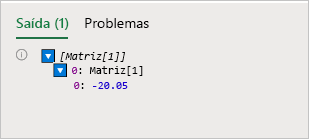
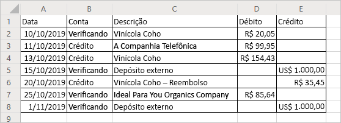

# <a name="read-workbook-data-with-office-scripts-in-excel-on-the-web"></a><span data-ttu-id="0b293-103">Ler os dados da pasta de trabalho com scripts do Office no Excel na Web.</span><span class="sxs-lookup"><span data-stu-id="0b293-103">Read workbook data with Office Scripts in Excel on the web</span></span>

<span data-ttu-id="0b293-104">Esse tutorial ensina a ler dados de uma pasta de trabalho com scripts do Office para o Excel na Web.</span><span class="sxs-lookup"><span data-stu-id="0b293-104">This tutorial will teach you how to read data from a workbook with an Office Script for Excel on the web.</span></span> <span data-ttu-id="0b293-105">Em seguida, edite os dados lidos e coloque-os de volta na pasta de trabalho.</span><span class="sxs-lookup"><span data-stu-id="0b293-105">You'll then edit the data you read and put it back in the workbook.</span></span>

> [!TIP]
> <span data-ttu-id="0b293-106">Se você não tiver experiência com os scripts do Office, recomendamos começar com o tutorial [Grave, edite e crie scripts do Office no Excel na Web](excel-tutorial.md).</span><span class="sxs-lookup"><span data-stu-id="0b293-106">If you are new to Office Scripts, we recommend starting with the [Record, edit, and create Office Scripts in Excel on the web](excel-tutorial.md) tutorial.</span></span>

## <a name="prerequisites"></a><span data-ttu-id="0b293-107">Pré-requisitos</span><span class="sxs-lookup"><span data-stu-id="0b293-107">Prerequisites</span></span>

[!INCLUDE [Preview note](../includes/preview-note.md)]

<span data-ttu-id="0b293-108">Antes de iniciar este tutorial, você precisará acessar os scripts do Office, que exigem o seguinte:</span><span class="sxs-lookup"><span data-stu-id="0b293-108">Before starting this tutorial, you'll need access to Office Scripts, which requires the following:</span></span>

- <span data-ttu-id="0b293-109">[Excel na Web](https://www.office.com/launch/excel).</span><span class="sxs-lookup"><span data-stu-id="0b293-109">[Excel on the web](https://www.office.com/launch/excel).</span></span>
- <span data-ttu-id="0b293-110">Peça para o administrador [habilitar os scripts do Office da sua organização](https://support.office.com/article/office-scripts-settings-in-m365-19d3c51a-6ca2-40ab-978d-60fa49554dcf), o que adiciona a guia **Automação** à faixa de opções.</span><span class="sxs-lookup"><span data-stu-id="0b293-110">Ask your administrator to [enable Office Scripts for your organization](https://support.office.com/article/office-scripts-settings-in-m365-19d3c51a-6ca2-40ab-978d-60fa49554dcf), which adds the **Automate** tab to the ribbon.</span></span>

> [!IMPORTANT]
> <span data-ttu-id="0b293-111">Este tutorial é destinado a pessoas com conhecimento básico ou de nível intermediário de JavaScript ou TypeScript.</span><span class="sxs-lookup"><span data-stu-id="0b293-111">This tutorial is intended for people with beginner to intermediate-level knowledge of JavaScript or TypeScript.</span></span> <span data-ttu-id="0b293-112">Se você não conhece o JavaScript, recomendamos que revise o [tutorial do Mozilla JavaScript](https://developer.mozilla.org/docs/Web/JavaScript/Guide/Introduction).</span><span class="sxs-lookup"><span data-stu-id="0b293-112">If you're new to JavaScript, we recommend reviewing the [Mozilla JavaScript tutorial](https://developer.mozilla.org/docs/Web/JavaScript/Guide/Introduction).</span></span> <span data-ttu-id="0b293-113">Visite [Scripts do Office no Excel na Web](../overview/excel.md) para saber mais sobre o ambiente de scripts.</span><span class="sxs-lookup"><span data-stu-id="0b293-113">Visit [Office Scripts in Excel on the web](../overview/excel.md) to learn more about the script environment.</span></span>

## <a name="read-a-cell"></a><span data-ttu-id="0b293-114">Ler uma célula</span><span class="sxs-lookup"><span data-stu-id="0b293-114">Read a cell</span></span>

<span data-ttu-id="0b293-115">Os scripts feitos com o Gravador de Ação só podem gravar informações na pasta de trabalho.</span><span class="sxs-lookup"><span data-stu-id="0b293-115">Scripts made with the Action Recorder can only write information to the workbook.</span></span> <span data-ttu-id="0b293-116">Com o Editor de Códigos, é possível editar e criar scripts que também leem dados de uma pasta de trabalho.</span><span class="sxs-lookup"><span data-stu-id="0b293-116">With the Code Editor, you can edit and make scripts that also read data from a workbook.</span></span>

<span data-ttu-id="0b293-117">Vamos criar um script que leia dados e atue com base no que foi lido.</span><span class="sxs-lookup"><span data-stu-id="0b293-117">Let's make a script that reads data and acts based on what was read.</span></span> <span data-ttu-id="0b293-118">Vamos usar um exemplo de um extrato bancário.</span><span class="sxs-lookup"><span data-stu-id="0b293-118">We're going to work with a sample banking statement.</span></span> <span data-ttu-id="0b293-119">Essa instrução é um relatório combinado de verificação de crédito.</span><span class="sxs-lookup"><span data-stu-id="0b293-119">This statement is a combined checking and credit statement.</span></span> <span data-ttu-id="0b293-120">Infelizmente, eles relatam alterações no balanço de forma diferente.</span><span class="sxs-lookup"><span data-stu-id="0b293-120">Unfortunately, they report balance changes differently.</span></span> <span data-ttu-id="0b293-121">A declaração de verificação exibe o rendimento como crédito positivo e custos como débito negativo.</span><span class="sxs-lookup"><span data-stu-id="0b293-121">The checking statement gives income as positive credit and costs as negative debit.</span></span> <span data-ttu-id="0b293-122">O demonstrativo de crédito faz o oposto.</span><span class="sxs-lookup"><span data-stu-id="0b293-122">The credit statement does the opposite.</span></span>

<span data-ttu-id="0b293-123">No resto do tutorial, normalizaremos os dados usando um script.</span><span class="sxs-lookup"><span data-stu-id="0b293-123">Over the rest of the tutorial, we will normalize this data using a script.</span></span> <span data-ttu-id="0b293-124">Primeiro, vamos aprender a ler os dados da pasta de trabalho.</span><span class="sxs-lookup"><span data-stu-id="0b293-124">First, let's learn how to read data from the workbook.</span></span>

1. <span data-ttu-id="0b293-125">Crie uma nova planilha na pasta de trabalho usada para o resto do tutorial.</span><span class="sxs-lookup"><span data-stu-id="0b293-125">Create a new worksheet in the workbook you've used for the rest of the tutorial.</span></span>
2. <span data-ttu-id="0b293-126">Copie os seguintes dados e cole-os na nova planilha, começando na célula **A1**.</span><span class="sxs-lookup"><span data-stu-id="0b293-126">Copy the following data and paste it into the new worksheet, starting at cell **A1**.</span></span>

    |<span data-ttu-id="0b293-127">Data</span><span class="sxs-lookup"><span data-stu-id="0b293-127">Date</span></span> |<span data-ttu-id="0b293-128">Conta</span><span class="sxs-lookup"><span data-stu-id="0b293-128">Account</span></span> |<span data-ttu-id="0b293-129">Descrição</span><span class="sxs-lookup"><span data-stu-id="0b293-129">Description</span></span> |<span data-ttu-id="0b293-130">Débito</span><span class="sxs-lookup"><span data-stu-id="0b293-130">Debit</span></span> |<span data-ttu-id="0b293-131">Crédito</span><span class="sxs-lookup"><span data-stu-id="0b293-131">Credit</span></span> |
    |:--|:--|:--|:--|:--|
    |<span data-ttu-id="0b293-132">10/10/2019</span><span class="sxs-lookup"><span data-stu-id="0b293-132">10/10/2019</span></span> |<span data-ttu-id="0b293-133">Verificando</span><span class="sxs-lookup"><span data-stu-id="0b293-133">Checking</span></span> |<span data-ttu-id="0b293-134">Vinícola Coho</span><span class="sxs-lookup"><span data-stu-id="0b293-134">Coho Vineyard</span></span> |<span data-ttu-id="0b293-135">-20.05</span><span class="sxs-lookup"><span data-stu-id="0b293-135">-20.05</span></span> | |
    |<span data-ttu-id="0b293-136">11/10/2019</span><span class="sxs-lookup"><span data-stu-id="0b293-136">10/11/2019</span></span> |<span data-ttu-id="0b293-137">Crédito</span><span class="sxs-lookup"><span data-stu-id="0b293-137">Credit</span></span> |<span data-ttu-id="0b293-138">A Companhia Telefônica</span><span class="sxs-lookup"><span data-stu-id="0b293-138">The Phone Company</span></span> |<span data-ttu-id="0b293-139">99.95</span><span class="sxs-lookup"><span data-stu-id="0b293-139">99.95</span></span> | |
    |<span data-ttu-id="0b293-140">13/10/2019</span><span class="sxs-lookup"><span data-stu-id="0b293-140">10/13/2019</span></span> |<span data-ttu-id="0b293-141">Crédito</span><span class="sxs-lookup"><span data-stu-id="0b293-141">Credit</span></span> |<span data-ttu-id="0b293-142">Vinícola Coho</span><span class="sxs-lookup"><span data-stu-id="0b293-142">Coho Vineyard</span></span> |<span data-ttu-id="0b293-143">154.43</span><span class="sxs-lookup"><span data-stu-id="0b293-143">154.43</span></span> | |
    |<span data-ttu-id="0b293-144">15/10/2019</span><span class="sxs-lookup"><span data-stu-id="0b293-144">10/15/2019</span></span> |<span data-ttu-id="0b293-145">Verificando</span><span class="sxs-lookup"><span data-stu-id="0b293-145">Checking</span></span> |<span data-ttu-id="0b293-146">Depósito externo</span><span class="sxs-lookup"><span data-stu-id="0b293-146">External Deposit</span></span> | |<span data-ttu-id="0b293-147">1000</span><span class="sxs-lookup"><span data-stu-id="0b293-147">1000</span></span> |
    |<span data-ttu-id="0b293-148">20/10/2019</span><span class="sxs-lookup"><span data-stu-id="0b293-148">10/20/2019</span></span> |<span data-ttu-id="0b293-149">Crédito</span><span class="sxs-lookup"><span data-stu-id="0b293-149">Credit</span></span> |<span data-ttu-id="0b293-150">Vinícola Coho – Reembolso</span><span class="sxs-lookup"><span data-stu-id="0b293-150">Coho Vineyard - Refund</span></span> | |<span data-ttu-id="0b293-151">-35.45</span><span class="sxs-lookup"><span data-stu-id="0b293-151">-35.45</span></span> |
    |<span data-ttu-id="0b293-152">25/10/2019</span><span class="sxs-lookup"><span data-stu-id="0b293-152">10/25/2019</span></span> |<span data-ttu-id="0b293-153">Verificando</span><span class="sxs-lookup"><span data-stu-id="0b293-153">Checking</span></span> |<span data-ttu-id="0b293-154">Ideal para sua empresa de produtos orgânicos</span><span class="sxs-lookup"><span data-stu-id="0b293-154">Best For You Organics Company</span></span> | <span data-ttu-id="0b293-155">-85.64</span><span class="sxs-lookup"><span data-stu-id="0b293-155">-85.64</span></span> | |
    |<span data-ttu-id="0b293-156">01/11/2019</span><span class="sxs-lookup"><span data-stu-id="0b293-156">11/01/2019</span></span> |<span data-ttu-id="0b293-157">Verificando</span><span class="sxs-lookup"><span data-stu-id="0b293-157">Checking</span></span> |<span data-ttu-id="0b293-158">Depósito externo</span><span class="sxs-lookup"><span data-stu-id="0b293-158">External Deposit</span></span> | |<span data-ttu-id="0b293-159">1000</span><span class="sxs-lookup"><span data-stu-id="0b293-159">1000</span></span> |

3. <span data-ttu-id="0b293-160">Abra o **Editor de códigos** e escolha **Novo script**.</span><span class="sxs-lookup"><span data-stu-id="0b293-160">Open the **Code Editor** and select **New Script**.</span></span>
4. <span data-ttu-id="0b293-161">Vamos limpar a formatação.</span><span class="sxs-lookup"><span data-stu-id="0b293-161">Let's clean up the formatting.</span></span> <span data-ttu-id="0b293-162">Este é um documento financeiro, iremos alterar a formatação dos números nas colunas **Débito** e **Crédito** para mostrar os valores em dólares.</span><span class="sxs-lookup"><span data-stu-id="0b293-162">This is a financial document, so let's change the number formatting in the **Debit** and **Credit** columns to show values as dollar amounts.</span></span> <span data-ttu-id="0b293-163">Também iremos ajustar a largura da coluna para os dados.</span><span class="sxs-lookup"><span data-stu-id="0b293-163">Let's also fit the column width to the data.</span></span>

    <span data-ttu-id="0b293-164">Substitua o conteúdo do script pelo código a seguir:</span><span class="sxs-lookup"><span data-stu-id="0b293-164">Replace the script contents with the following code:</span></span>

    ```TypeScript
    async function main(context: Excel.RequestContext) {
      // Get the current worksheet.
      let workbook = context.workbook;
      let worksheets = workbook.worksheets;
      let selectedSheet = worksheets.getActiveWorksheet();

      // Format the range to display numerical dollar amounts.
      selectedSheet.getRange("D2:E8").numberFormat = [["$#,##0.00"]];

      // Fit the width of all the used columns to the data.
      selectedSheet.getUsedRange().format.autofitColumns();
    }
    ```

5. <span data-ttu-id="0b293-165">Agora, leremos um valor de uma das colunas de número.</span><span class="sxs-lookup"><span data-stu-id="0b293-165">Now let's read a value from one of the number columns.</span></span> <span data-ttu-id="0b293-166">Adicione o seguinte código ao final do script:</span><span class="sxs-lookup"><span data-stu-id="0b293-166">Add the following code to the end of the script:</span></span>

    ```TypeScript
    // Get the value of cell D2.
    let range = selectedSheet.getRange("D2");
    range.load("values");
    await context.sync();
  
    // Print the value of D2.
    console.log(range.values);
    ```

    <span data-ttu-id="0b293-167">Anote as chamadas para `load` e `sync`.</span><span class="sxs-lookup"><span data-stu-id="0b293-167">Note the calls to `load` and `sync`.</span></span> <span data-ttu-id="0b293-168">Aprenda mais detalhes desses métodos em [Fundamentos de Scripts do Office no Excel na Web](../develop/scripting-fundamentals.md#sync-and-load).</span><span class="sxs-lookup"><span data-stu-id="0b293-168">You can learn the details of those methods in [Scripting Fundamentals for Office Scripts in Excel on the web](../develop/scripting-fundamentals.md#sync-and-load).</span></span> <span data-ttu-id="0b293-169">Por enquanto, solicite que os dados sejam lidos e sincronize seu script com a pasta de trabalho para lê-los.</span><span class="sxs-lookup"><span data-stu-id="0b293-169">For now, know that you must request data to be read and then sync your script with the workbook to read that data.</span></span>

6. <span data-ttu-id="0b293-170">Execute o script.</span><span class="sxs-lookup"><span data-stu-id="0b293-170">Run the script.</span></span>
7. <span data-ttu-id="0b293-171">Abra o console.</span><span class="sxs-lookup"><span data-stu-id="0b293-171">Open the console.</span></span> <span data-ttu-id="0b293-172">Vá para o menu **Reticências** e pressione **Logs...**.</span><span class="sxs-lookup"><span data-stu-id="0b293-172">Go to the **Ellipses** menu and press **Logs...**.</span></span>
8. <span data-ttu-id="0b293-173">Você deverá ver `[Array[1]]` no console.</span><span class="sxs-lookup"><span data-stu-id="0b293-173">You should see `[Array[1]]` in the console.</span></span> <span data-ttu-id="0b293-174">Isso não é um número porque os intervalos são matrizes bidimensionais de dados.</span><span class="sxs-lookup"><span data-stu-id="0b293-174">This is not a number because ranges are two-dimensional arrays of data.</span></span> <span data-ttu-id="0b293-175">Esse intervalo bidimensional está sendo registrado diretamente no console.</span><span class="sxs-lookup"><span data-stu-id="0b293-175">That two-dimensional range is being logged to the console directly.</span></span> <span data-ttu-id="0b293-176">Felizmente, o Editor de códigos permite visualizar o conteúdo da matriz.</span><span class="sxs-lookup"><span data-stu-id="0b293-176">Luckily, the Code Editor does let you see the contents of the array.</span></span>
9. <span data-ttu-id="0b293-177">Quando uma matriz bidimensional é registrada no console, ela agrupa os valores de coluna em cada linha.</span><span class="sxs-lookup"><span data-stu-id="0b293-177">When a two-dimensional array is logged to the console, it groups column values under each row.</span></span> <span data-ttu-id="0b293-178">Expanda o log de matriz pressionando o triângulo azul.</span><span class="sxs-lookup"><span data-stu-id="0b293-178">Expand the array log by pressing the blue triangle.</span></span>
10. <span data-ttu-id="0b293-179">Expanda o segundo nível da matriz, pressionando o triângulo azul exibido recentemente.</span><span class="sxs-lookup"><span data-stu-id="0b293-179">Expand the second level of the array by pressing the newly revealed blue triangle.</span></span> <span data-ttu-id="0b293-180">Agora, você deverá ver isto:</span><span class="sxs-lookup"><span data-stu-id="0b293-180">You should now see this:</span></span>

    

## <a name="modify-the-value-of-a-cell"></a><span data-ttu-id="0b293-182">Modificar o valor de uma célula</span><span class="sxs-lookup"><span data-stu-id="0b293-182">Modify the value of a cell</span></span>

<span data-ttu-id="0b293-183">Agora que podemos ler os dados, usaremos eles para modificar a pasta de trabalho.</span><span class="sxs-lookup"><span data-stu-id="0b293-183">Now that we can read data, let's use that data to modify the workbook.</span></span> <span data-ttu-id="0b293-184">Deixaremos o valor da célula **D2** positivo com a função `Math.abs`.</span><span class="sxs-lookup"><span data-stu-id="0b293-184">We'll make the value of the cell **D2** positive with the `Math.abs` function.</span></span> <span data-ttu-id="0b293-185">O objeto [Matemática](https://developer.mozilla.org/docs/web/javascript/reference/global_objects/math) contém várias funções às quais seus scripts têm acesso.</span><span class="sxs-lookup"><span data-stu-id="0b293-185">The [Math](https://developer.mozilla.org/docs/web/javascript/reference/global_objects/math) object contains many functions to which your scripts have access.</span></span> <span data-ttu-id="0b293-186">É possível encontrar mais informações sobre `Math` e outros objetos internos [Usando objetos JavaScript internos nos scripts do Office](../develop/javascript-objects.md).</span><span class="sxs-lookup"><span data-stu-id="0b293-186">More information about `Math` and other built-in objects can be found at [Using built-in JavaScript objects in Office Scripts](../develop/javascript-objects.md).</span></span>

1. <span data-ttu-id="0b293-187">Adicione o seguinte código ao final do script:</span><span class="sxs-lookup"><span data-stu-id="0b293-187">Add the following code to the end of the script:</span></span>

    ```TypeScript
    // Run the `Math.abs` function with the value at D2 and apply that value back to D2.
    let positiveValue = Math.abs(range.values[0][0]);
    range.values = [[positiveValue]];
    ```

2. <span data-ttu-id="0b293-188">O valor da célula **D2** agora deverá ser positivo.</span><span class="sxs-lookup"><span data-stu-id="0b293-188">The value of cell **D2** should now be positive.</span></span>

## <a name="modify-the-values-of-a-column"></a><span data-ttu-id="0b293-189">Modificar os valores de uma coluna</span><span class="sxs-lookup"><span data-stu-id="0b293-189">Modify the values of a column</span></span>

<span data-ttu-id="0b293-190">Agora que sabemos ler e escrever em uma única célula, vamos generalizar o script para trabalhar em todas as colunas de **Débito** e **Crédito**.</span><span class="sxs-lookup"><span data-stu-id="0b293-190">Now that we know how to read and write to a single cell, let's generalize the script to work on the entire **Debit** and **Credit** columns.</span></span>

1. <span data-ttu-id="0b293-191">Remova o código que afeta apenas uma única célula (o código de valor absoluto anterior), de modo que o script agora se pareça com este:</span><span class="sxs-lookup"><span data-stu-id="0b293-191">Remove the code that affects only a single cell (the previous absolute value code), such that your script now looks like this:</span></span>

    ```TypeScript
    async function main(context: Excel.RequestContext) {
      // Get the current worksheet.
      let workbook = context.workbook;
      let worksheets = workbook.worksheets;
      let selectedSheet = worksheets.getActiveWorksheet();

      // Format the range to display numerical dollar amounts.
      selectedSheet.getRange("D2:E8").numberFormat = [["$#,##0.00"]];

      // Fit the width of all the used columns to the data.
      selectedSheet.getUsedRange().format.autofitColumns();
    }
    ```

2. <span data-ttu-id="0b293-192">Adicione um loop que percorra as linhas nas duas últimas colunas.</span><span class="sxs-lookup"><span data-stu-id="0b293-192">Add a loop that iterates through the rows in the last two columns.</span></span> <span data-ttu-id="0b293-193">Para cada célula, o script define o valor para o valor absoluto do valor atual.</span><span class="sxs-lookup"><span data-stu-id="0b293-193">For each cell, the script sets the value to the current value's absolute value.</span></span>

    <span data-ttu-id="0b293-194">Observe que a matriz que define a localização das células é baseada em zero.</span><span class="sxs-lookup"><span data-stu-id="0b293-194">Note that the array defining cell locations is zero-based.</span></span> <span data-ttu-id="0b293-195">Isso significa que a célula **A1** é `range[0][0]`.</span><span class="sxs-lookup"><span data-stu-id="0b293-195">That means cell **A1** is `range[0][0]`.</span></span>

    ```TypeScript
    // Get the values of the used range.
    let range = selectedSheet.getUsedRange();
    range.load("rowCount,values");
    await context.sync();

    // Iterate over the fourth and fifth columns and set their values to their absolute value.
    for (let i = 1; i < range.rowCount; i++) {
      // The column at index 3 is column "4" in the worksheet.
      if (range.values[i][3] != 0) {
        let positiveValue = Math.abs(range.values[i][3]);
        selectedSheet.getCell(i, 3).values = [[positiveValue]];
      }

      // The column at index 4 is column "5" in the worksheet.
      if (range.values[i][4] != 0) {
        let positiveValue = Math.abs(range.values[i][4]);
        selectedSheet.getCell(i, 4).values = [[positiveValue]];
      }
    }
    ```

    <span data-ttu-id="0b293-196">Essa parte do script faz várias tarefas importantes.</span><span class="sxs-lookup"><span data-stu-id="0b293-196">This portion of the script does several important tasks.</span></span> <span data-ttu-id="0b293-197">Primeiro, ela carrega os valores e a contagem de linhas do intervalo usado.</span><span class="sxs-lookup"><span data-stu-id="0b293-197">First, it loads the values and row count of the used range.</span></span> <span data-ttu-id="0b293-198">Isso nos permite ver os valores e saber quando parar.</span><span class="sxs-lookup"><span data-stu-id="0b293-198">This lets us look at values and know when to stop.</span></span> <span data-ttu-id="0b293-199">Segundo, ela reitera através do intervalo usado, verificando cada célula nas colunas **Débito** ou **Crédito**.</span><span class="sxs-lookup"><span data-stu-id="0b293-199">Second, it iterates through the used range, checking each cell in the **Debit** or **Credit** columns.</span></span> <span data-ttu-id="0b293-200">Por fim, se o valor na célula não for 0, ele será substituído pelo valor absoluto.</span><span class="sxs-lookup"><span data-stu-id="0b293-200">Finally, if the value in the cell is not 0, it is replaced by its absolute value.</span></span> <span data-ttu-id="0b293-201">Estamos evitando zeros, para que possamos deixar as células em branco.</span><span class="sxs-lookup"><span data-stu-id="0b293-201">We're avoiding zeroes so we can leave the blank cells as they were.</span></span>

3. <span data-ttu-id="0b293-202">Execute o script.</span><span class="sxs-lookup"><span data-stu-id="0b293-202">Run the script.</span></span>

    <span data-ttu-id="0b293-203">Seu extrato bancário agora deverá ter a seguinte aparência:</span><span class="sxs-lookup"><span data-stu-id="0b293-203">Your banking statement should now look like this:</span></span>

    

## <a name="next-steps"></a><span data-ttu-id="0b293-205">Próximas etapas</span><span class="sxs-lookup"><span data-stu-id="0b293-205">Next steps</span></span>

<span data-ttu-id="0b293-206">Abra o Editor de códigos e experimente alguns dos [Scripts de exemplo para scripts do Office no Excel na Web](../resources/excel-samples.md).</span><span class="sxs-lookup"><span data-stu-id="0b293-206">Open the Code Editor and try out some of our [Sample scripts for Office Scripts in Excel on the web](../resources/excel-samples.md).</span></span> <span data-ttu-id="0b293-207">Visite também [Fundamentos de Scripts do Office no Excel na Web](../develop/scripting-fundamentals.md) para saber mais sobre como criar scripts do Office.</span><span class="sxs-lookup"><span data-stu-id="0b293-207">You can also visit [Scripting Fundamentals for Office Scripts in Excel on the web](../develop/scripting-fundamentals.md) to learn more about creating Office Scripts.</span></span>
