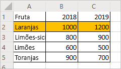
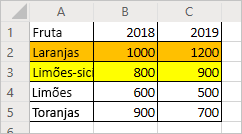
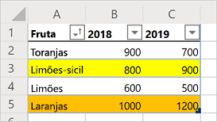

# <a name="record-edit-and-create-office-scripts-in-excel-on-the-web"></a>Grave, edite e crie scripts do Office no Excel na Web

Este tutorial ensina os fundamentos da gravação, edição e escrita de um Script do para o Excel na web. Você gravará um script que aplicará uma determinada formatação a uma planilha de registro de vendas. Depois, você editará o script gravado para aplicar outras formatações, criar e classificar uma tabela. Este padrão de registro e edição é uma importante ferramenta para ver como suas ações no Excel são parecidas com um código.

## <a name="prerequisites"></a>Pré-requisitos

[!INCLUDE [Tutorial prerequisites](../includes/tutorial-prerequisites.md)]

> [!IMPORTANT]
> Este tutorial é destinado a pessoas com conhecimento básico ou de nível intermediário de JavaScript ou TypeScript. Se você é novo no JavaScript, recomendamos começar com o [tutorial da Mozilla sobre JavaScript](https://developer.mozilla.org/docs/Web/JavaScript/Guide/Introduction). Visite o [ambiente do Editor de Código do Scripts do Office](../overview/code-editor-environment.md) para saber mais sobre o ambiente de script.

## <a name="add-data-and-record-a-basic-script"></a>Adicione dados e grave um script básico

Primeiro, precisaremos de alguns dados e um pequeno script inicial.

1. Crie uma nova pasta de trabalho no Excel para a Web.
2. Copie os seguintes dados de vendas de frutas e cole-os na planilha, começando na célula **A1**.

    |Fruta |2018 |2019 |
    |:---|:---|:---|
    |Laranjas |1.000 |1.200 |
    |Limões |800 |900 |
    |Limões-galego |600 |500 |
    |Toranjas |900 |700 |

3. Abra a guia **Automação**. Se você não vir a guia **Automação**, verifique o extravasamento da fita pressionando a seta suspensa.
4. Pressione o botão **Ações de registro**.
5. Clique nas células **A2:C2** (a linha "Laranjas") e defina a cor de preenchimento como laranja.
6. Pare a gravação pressionando o botão **Parar**.
7. Preencha o campo **Nome do script** com um nome digno de memória.
8. *Opcional:* Preencha o campo **Descrição** com uma descrição significativa. Isso é usado para fornecer contexto sobre o que o script faz. Para o tutorial, você pode usar "Linhas de códigos de cores de uma tabela".

   > [!TIP]
   > Você pode editar a descrição de um script posteriormente no painel **Detalhes do script**, localizado no menu do Editor de códigos **...**.

9. Salve o script pressionando o botão **Salvar**.

    Sua planilha deve ficar assim (não se preocupe se a cor for diferente):

    

## <a name="edit-an-existing-script"></a>Edite um script existente

O script anterior coloriu a linha "Laranjas" para ficar laranja. Vamos adicionar uma linha amarela aos "Limões".

1. A partir do painel, agora aberto em **Detalhes**, pressione o botão **Editar**.
2. Você deve ver algo semelhante a este código:

    ```TypeScript
    function main(workbook: ExcelScript.Workbook) {
      // Set fill color to FFC000 for range Sheet1!A2:C2
      let selectedSheet = workbook.getActiveWorksheet();
      selectedSheet.getRange("A2:C2").getFormat().getFill().setColor("FFC000");
    }
    ```

    Este código recebe a planilha atual da pasta de trabalho. Depois, defina a cor de preenchimento do intervalo **A2:C2**.

    Os intervalos são parte fundamental dos scripts do Office no Excel na Web. Um intervalo é um bloco retangular e contíguo de células que contém valores, fórmula e formatação. Eles são a estrutura básica das células através da qual você executará a maioria das tarefas de script.

3. Adicione a seguinte linha no final do script (entre onde `color` está definido e o encerramento `}`):

    ```TypeScript
    selectedSheet.getRange("A3:C3").getFormat().getFill().setColor("yellow");
    ```

4. Teste o script pressionando **Executar**. Sua pasta de trabalho já deve ter esta aparência:

    

## <a name="create-a-table"></a>Crie uma tabela

Vamos converter esses dados de vendas de frutas em uma tabela. Usaremos nosso script em todo o processo.

1. Adicione a seguinte linha no final do script (antes do encerramento `}`):

    ```TypeScript
    let table = selectedSheet.addTable("A1:C5", true);
    ```

2. Essa chamada retorna um `Table` objeto. Vamos usar essa tabela para classificar os dados. Classificaremos os dados em ordem crescente com base nos valores na coluna "Frutas". Adicione a seguinte linha assim que criar a tabela:

    ```TypeScript
    table.getSort().apply([{ key: 0, ascending: true }]);
    ```

    Seu script deve ter esta aparência:

    ```TypeScript
    function main(workbook: ExcelScript.Workbook) {
        // Set fill color to FFC000 for range Sheet12!A2:C2
        let selectedSheet = workbook.getActiveWorksheet();
        selectedSheet.getRange("A2:C2").getFormat().getFill().setColor("FFC000");
        selectedSheet.getRange("A3:C3").getFormat().getFill().setColor("yellow");
        let table = selectedSheet.addTable("A1:C5", true);
        table.getSort().apply([{ key: 0, ascending: true }]);
    }
    ```

    As tabelas possuem um objeto`TableSort`, acessado por meio do método `Table.getSort`. Você pode aplicar critérios de classificação a esse objeto. O `apply` método utiliza uma matriz de `SortField` objetos. Nesse caso, só temos um critério de classificação, por isso só usamos um. `SortField`. `key: 0` define a coluna com os valores que determinam a classificação como "0" (que nesse caso, é a primeira coluna na tabela **A** ). `ascending: true` classifica os dados em ordem crescente (em vez de ordem decrescente).

3. Execute o script. Você deve visualizar uma tabela como esta:

    

    > [!NOTE]
    > Se você executar novamente o script, receberá um erro. Isso ocorre porque você não pode criar uma tabela em cima de outra tabela. No entanto, você pode executar o script em uma planilha ou pasta de trabalho diferente.

### <a name="re-run-the-script"></a>Reexecute o script

1. Crie uma nova planilha na pasta de trabalho atual.
2. Copie os dados das frutas do início do tutorial e cole-os na nova planilha, começando na célula **A1**.
3. Execute o script.

## <a name="next-steps"></a>Próximas etapas

Conclua o tutorial [Ler os dados da pasta de trabalho com scripts do Office no Excel na Web.](excel-read-tutorial.md). Ele ensina como ler dados de uma pasta de trabalho com um script do Office.
